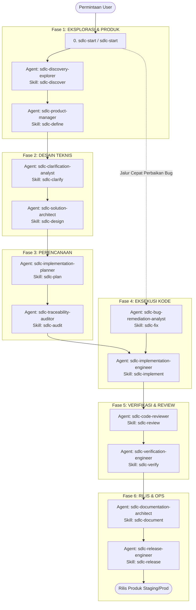

# ⚡ Portable Agentic SDLC Toolkit

🌐 **Bahasa**: [English](README.md) | [Bahasa Indonesia](README.id.md)

> **Tingkatkan kemampuan AI coding agents Anda dengan alur kerja SDLC yang bebas dari ketergantungan vendor, peran terbatasi (bounded roles), dan skill yang dapat digunakan kembali — diinstal dalam hitungan detik tanpa dependensi.**

[](LICENSE)
[](#-mulai-cepat-quick-start)
[](#-platform-yang-didukung--jalur-global)

---

## 💡 Mengapa Agentic SDLC Toolkit?

Saat menggunakan asisten AI coding (Claude Code, OpenCode, GitHub Copilot, Codex, Gemini/Antigravity, OMP), AI agent tanpa panduan sering kali langsung menulis kode tanpa verifikasi, melakukan halusinasi dependensi, atau menimpa file penting secara tidak sengaja.

**Agentic SDLC Toolkit** memberikan proses rekayasa perangkat lunak (SDLC) yang terstruktur dan teruji bagi AI agent Anda—mulai dari riset awal (discovery) dan penulisan PRD, pembuatan spesifikasi teknis, perencanaan implementasi, code review, verifikasi independen, hingga kesiapan rilis.

- 🚀 **Nol Dependensi**: Script installer murni Shell & PowerShell. Tidak memerlukan runtime Python atau Node untuk menginstal.
- 🎯 **Portabel & Bebas Vendor**: Tulis aturan SDLC sekali, jalankan di platform AI mana pun.
- 🛡️ **Aman & Terkendali**: Mendukung mode uji coba (dry-run). Tidak akan menimpa kode atau konfigurasi Anda tanpa izin.
- 🤖 **Native Multi-Platform**: Paket bawaan untuk Claude Code, OpenCode, Codex, GitHub Copilot, Gemini/Antigravity, dan OMP.

---

## 🚀 Mulai Cepat (Quick Start)

Jalankan 1 baris perintah di terminal Anda untuk membuka wizard interaktif pilihan platform dan skop instalasi:

### 🐧 Linux / macOS / WSL
```bash
curl -fsSL https://raw.githubusercontent.com/coderbuzz/agent-toolkit/main/install.sh | bash
```

### 🪟 Windows (PowerShell)
```powershell
irm https://raw.githubusercontent.com/coderbuzz/agent-toolkit/main/install.ps1 | iex
```

> **Tips Otomatisasi (CI / Non-Interaktif)**: Lewati pertanyaan wizard dengan menambahkan argumen langsung:
> ```bash
> curl -fsSL https://raw.githubusercontent.com/coderbuzz/agent-toolkit/main/install.sh | bash -s -- --platform opencode --global --apply
> ```

### 🧹 Uninstallation (Pembersihan / Uninstall)

Untuk melihat preview dan menghapus file toolkit secara aman (menjaga perubahan pengguna):

```bash
# Uninstaller interaktif — remote (Linux / macOS / WSL)
curl -fsSL https://raw.githubusercontent.com/coderbuzz/agent-toolkit/main/uninstall.sh | bash

# Mode non-interaktif / CI
curl -fsSL https://raw.githubusercontent.com/coderbuzz/agent-toolkit/main/uninstall.sh | bash -s -- --platform opencode --scope global --apply
```

```powershell
# Uninstaller interaktif — remote (Windows PowerShell)
irm https://raw.githubusercontent.com/coderbuzz/agent-toolkit/main/uninstall.ps1 | iex

# Mode non-interaktif
irm https://raw.githubusercontent.com/coderbuzz/agent-toolkit/main/uninstall.ps1 | iex -ArgumentList --platform opencode --scope global --apply
```

```bash
# Sudah clone? Jalankan lokal saja (Linux / macOS / WSL)
./uninstall.sh
./uninstall.sh --scope repository --target . --apply
```

```powershell
# Sudah clone? Jalankan lokal saja (Windows PowerShell)
.\uninstall.ps1
.\uninstall.ps1 --platform opencode --scope global --apply
```

---

## 🧠 Mengakses Skill

Toolkit menyediakan skill SDLC yang dimuat agent sesuai kebutuhan. Cara mengaksesnya tergantung platform:

- **Menu `/skills`**: Menampilkan semua skill yang terpasang. OpenCode mengurutkan daftar ini alfabetis — urutannya bukan urutan alur SDLC.
- **Skill tool**: Agent memuat skill lewat tool bawaan `skill`. Picker `@` menampilkan **agent dan file**, bukan skill.
- **Slash commands OpenCode**: Setelah install global, tiap skill juga tersedia sebagai command `/sdlc-<nama>` (mis. `/sdlc-start`, `/sdlc-discover`, `/sdlc-fix`) yang memuat dan menjalankan skill terkait.
- **Penamaan**: ID skill memakai hyphen (`sdlc-start`), bukan underscore. Ketik persis seperti itu.

Alur SDLC alami: `start → discover → define → clarify → design → audit → plan → implement → verify → review → fix → release → document`, dengan skill lintas-fase (`guardrails`, `memory`, `glossary`, `decide`, `test`, `threat`, `audit-deps`, `orchestrate`) dan spesialis opsional (`design-ui`, `incident`, `observability`, `migrate`).

## 💡 Penggunaan — command `/` vs mention `@`

Dua cara masuk di OpenCode yang memicu mekanisme berbeda:

| Input | Fungsi | Di toolkit ini |
| --- | --- | --- |
| `/sdlc-<nama>` | Menjalankan **skill** di sesi saat ini (prosedur + persona). | `/sdlc-start`, `/sdlc-discover`, `/sdlc-fix`, ... |
| `@<agent>` | Memanggil **subagent** dengan tool & permission sendiri. | `@sdlc-discovery-explorer`, `@sdlc-solution-architect`, ... |
| `@<file>` | Menambahkan isi file ke konteks. | Bukan khusus toolkit. |
| `/skills` | Menampilkan semua skill terpasang. | 21 skill core (alfabetis). |

Singkatnya: **skill** menjelaskan *bagaimana* mengerjakan, **agent** menentukan *siapa* yang mengerjakan.

## 🚦 Best practice — mulai dari nol

1. **Selalu routing dulu.** Jalankan `/sdlc-start`. Ia mengklasifikasi tugas ke lane paling aman (Full-Feature, Bug-Fix, Small-Change, Docs, Incident) serta daftar artefak, gate, dan peran agent berikutnya. Ia tidak pernah memaksakan lifecycle penuh pada pekerjaan berisiko rendah.
2. **Ikuti fase dengan agent.** Setiap fase memasangkan agent (`@`) dengan skill primer (`/`):
   - **Discover & Define**: `@sdlc-discovery-explorer` `/sdlc-discover` → `@sdlc-product-manager` `/sdlc-define`
   - **Architect & Design**: `@sdlc-clarification-analyst` `/sdlc-clarify` → `@sdlc-solution-architect` `/sdlc-design`
   - **Plan & Audit**: `@sdlc-implementation-planner` `/sdlc-plan` → `@sdlc-traceability-auditor` `/sdlc-audit`
   - **Build**: `@sdlc-implementation-engineer` `/sdlc-implement`
   - **Verify & Review**: `@sdlc-code-reviewer` `/sdlc-review` → `@sdlc-verification-engineer` `/sdlc-verify`
   - **Ship**: `@sdlc-documentation-architect` `/sdlc-document` → `@sdlc-release-engineer` `/sdlc-release`
3. **Gunakan jalur cepat.** Bug langsung ke `/sdlc-fix` → `@sdlc-bug-remediation-analyst` → engineer → verifier. Perubahan kecil yang reversible melewati lifecycle sepenuhnya. Keputusan arsitektur yang mahal memakai `/sdlc-decide`.
4. **Hormati urutan artefak.** Jangan minta spec sebelum PRD, atau implementasi sebelum plan disetujui.
5. **Setujui aksi ber-gate.** Publishing, deployment, release, aksi destruktif, dan perubahan kredensial selalu memerlukan persetujuan eksplisit Anda.
6. **Satu persona per sesi.** Skill persona-bound (`sdlc-start`, `sdlc-discover`, ...) mengunci sesi; skill utility (`sdlc-guardrails`, `sdlc-memory`, `sdlc-glossary`) bebas dipanggil kapan pun.

---

## 🗺️ Alur Kerja & 6-Fase SDLC Lifecycle

Berinteraksi dengan AI agents menjadi sangat mudah dan dapat diprediksi ketika dikelompokkan ke dalam **6 fase utama + 1 navigasi awal**:

```
[0. NAVIGASI / MULAI] ➔ [1. EKSPLORASI & PRODUK] ➔ [2. DESAIN TEKNIS] ➔ [3. PERENCANAAN] ➔ [4. EKSEKUSI KODE] ➔ [5. VERIFIKASI & REVIEW] ➔ [6. RILIS & OPS]
```

### 📊 Diagram Alur Lengkap (Mermaid)



---

## 🧰 Referensi Lengkap Agent & Skill Berdasarkan Fase

### Fase 0: Navigasi Awal (Entrypoint)
Jika Anda ragu dari mana harus memulai suatu tugas, panggil skill pemandu awal:
- 🚀 **`sdlc-start`** *(atau `sdlc-start`)*: Mengklasifikasikan pekerjaan ke jalur keamanan yang tepat (Fitur Baru, Perbaikan Bug, Perubahan Kecil, Dokumentasi, atau Insiden) dan memandu langkah eksekusi agent secara bertahap.

---

### Fase 1: Eksplorasi & Produk (Product Scope)
| Peran Agent | Skill Utama | Skill Pendukung | Artefak Hasil Fase |
| :--- | :--- | :--- | :--- |
| **`sdlc-discovery-explorer`** | `sdlc-discover` | `sdlc-guardrails` | **Discovery Report (Riset Awal)** |
| **`sdlc-product-manager`** | `sdlc-define` | `sdlc-glossary` | **Product Requirements Document (PRD)** |

---

### Fase 2: Desain Teknis & Keamanan (Architecture & Design)
| Peran Agent | Skill Utama | Skill Pendukung | Artefak Hasil Fase |
| :--- | :--- | :--- | :--- |
| **`sdlc-clarification-analyst`** | `sdlc-clarify` | `sdlc-decide` | **Tanya-Jawab Klarifikasi / ADR** |
| **`sdlc-solution-architect`** | `sdlc-design` | `sdlc-threat`, `sdlc-design-ui`, `sdlc-test` | **Technical Specification (Spesifikasi Teknis)** |

---

### Fase 3: Perencanaan Eksekusi (Planning & Audit)
| Peran Agent | Skill Utama | Skill Pendukung | Artefak Hasil Fase |
| :--- | :--- | :--- | :--- |
| **`sdlc-implementation-planner`** | `sdlc-plan` | `sdlc-test` | **Implementation Plan (Rencana Eksekusi)** |
| **`sdlc-traceability-auditor`** | `sdlc-audit` | - | **Laporan Audit Keterlacakan (Traceability)** |

---

### Fase 4: Eksekusi Kode & Perbaikan Bug (Build & Remediate)
| Peran Agent | Skill Utama | Skill Pendukung | Artefak Hasil Fase |
| :--- | :--- | :--- | :--- |
| **`sdlc-implementation-engineer`** | `sdlc-implement` | `sdlc-guardrails`, `sdlc-migrate`, `sdlc-audit-deps`, `sdlc-orchestrate` | **Kode Sumber & Test Unit** |
| **`sdlc-bug-remediation-analyst`** *(Jalur Bug)* | `sdlc-fix` | `sdlc-test` | **Analisis Root Cause & Rencana Perbaikan** |

---

### Fase 5: Verifikasi & Review Kualitas (Verify & Review)
| Peran Agent | Skill Utama | Skill Pendukung | Artefak Hasil Fase |
| :--- | :--- | :--- | :--- |
| **`sdlc-code-reviewer`** | `sdlc-review` | `sdlc-audit-deps` | **Umpan Balik Review Kode** |
| **`sdlc-verification-engineer`** | `sdlc-verify` | `sdlc-test` | **Laporan Verifikasi Pengujian** |

---

### Fase 6: Rilis & Operasional (Ship & Maintain)
| Peran Agent | Skill Utama | Skill Pendukung | Artefak Hasil Fase |
| :--- | :--- | :--- | :--- |
| **`sdlc-documentation-architect`** | `sdlc-document` | `sdlc-glossary` | **Dokumentasi & Panduan Pengguna** |
| **`sdlc-release-engineer`** | `sdlc-release` | `sdlc-orchestrate` | **Kandidat Rilis Terverifikasi** |
| *(Operasional)* | `sdlc-observability` | `sdlc-incident`, `sdlc-memory` | **Desain Log/Metrik & Incident Log** |

---

## 🔄 Jalur Kerja (SDLC Lanes)

Toolkit ini secara otomatis mengarahkan setiap perubahan ke jalur yang sesuai untuk menghindari beban berlebih (*overhead*) pada perubahan kecil, sambil tetap menjaga aturan ketat pada fitur besar:

| Jalur (Lane) | Pemicu & Cakupan | Urutan Alur Kerja Wajib |
| :--- | :--- | :--- |
| **Fitur-Lengkap (Full-Feature)** | Fitur baru, perubahan arsitektur besar, API publik, data sensitif | Discovery → PRD → Spec → Plan → Eksekusi → Review → Verifikasi → Rilis |
| **Perbaikan-Bug (Bug-Fix)** | Cacat kode (bug) yang dapat direproduksi dengan perilaku yang jelas | Analisis Root Cause → Rencana Perbaikan Minimal → Test Reproduksi & Perbaikan → Verifikasi |
| **Perubahan-Kecil (Small-Change)** | Perubahan berisiko rendah, mudah dibatalkan, dan lingkup sempit | Perbaikan Langsung → Uji Test Terfokus → Code Review |
| **Dokumentasi (Documentation)** | Pembaruan dokumen, komentar kode, atau panduan manual | Audit → Draf/Pembaruan → Verifikasi Link & Kejelasan |
| **Insiden (Incident)** | Gangguan layanan produksi aktif, insiden keamanan, atau kehilangan data | Penilaian Keparahan → Lokalisasi Masalah → Root Cause → Post-Mortem |

---

## 💬 Contoh Prompt Bahasa Alami

Karena agen dan skill diinstal secara global atau di tingkat proyek, Anda tidak memerlukan menu UI khusus. Cukup berikan perintah kepada AI agent Anda dalam bahasa sehari-hari:

### 1. Memulai Fitur / Proyek Baru (Getting Started)
```text
"Gunakan skill sdlc-start untuk memandu saya membuat sistem autentikasi JWT dan OAuth2. Buatkan PRD dan technical specification terlebih dahulu."
```

### 2. Memperbaiki Bug (Bug-Fix Lane)
```text
"User melaporkan error 500 saat checkout ketika keranjang belanja kosong. Gunakan skill sdlc-fix untuk melacak penyebab utama (root cause), buat test reproduksi, dan perbaiki dengan perubahan minimal."
```

### 3. Review Kode / Pull Request
```text
"Tolong lakukan review kode pada branch ini menggunakan skill sdlc-review. Periksa aspek keamanan, performa, dan kesesuaian dengan spesifikasi teknis kita."
```

### 4. Membuat Catatan Keputusan Arsitektur (ADR)
```text
"Kita perlu memilih antara Redis vs PostgreSQL untuk caching sesi. Gunakan skill sdlc-decide untuk mengevaluasi trade-off dan buatkan ADR."
```

### 5. Audit Kesiapan Rilis
```text
"Tolong audit repository ini menggunakan skill sdlc-release sebelum kita melakukan rilis v1.0.0."
```

---

## 🌐 Platform yang Didukung & Jalur Global

Instal sekali secara global di direktori home Anda (`$HOME`) agar semua repository otomatis mengenali AI agents dan skill ini:

| Platform | Instruksi Global | Agents Global | Skills Global |
| :--- | :--- | :--- | :--- |
| **Claude Code** | `~/.claude/CLAUDE.md` | `~/.claude/agents/*.md` | `~/.agents/skills/*` |
| **OpenCode** | `~/.config/opencode/AGENTS.md` | `~/.config/opencode/agents/*.md` | `~/.agents/skills/*` |
| **Codex** | `~/.codex/AGENTS.md` | Managed block di `~/.codex/config.toml` | `~/.agents/skills/*` |
| **GitHub Copilot** | `~/.copilot/copilot-instructions.md` | `~/.copilot/agents/*.agent.md` | `~/.agents/skills/*` |
| **OMP** | `~/.omp/agent/AGENTS.md` | `~/.omp/agent/agents/*.md` | `~/.agents/skills/*` |
| **Gemini / Antigravity** | `~/.gemini/antigravity/AGENTS.md` | `~/.gemini/antigravity/agents/*.md` | `~/.agents/skills/*` |

---

## 📦 Paket Skill (Skill Bundles)

| Paket | Isi Skill | Sangat Cocok Untuk |
| :--- | :--- | :--- |
| **`core`** *(bawaan)* | Skill utama siklus SDLC & tata kelola umum | Pengembangan fitur harian & perbaikan bug |
| **`full`** | Core + skill spesialis (migrasi data, insiden) | Siklus produk lengkap & tim ops |
| **`quality`** | Audit, keamanan, threat modeling & verifikasi | Repositori matang yang membutuhkan standar kualitas tinggi |

---

## 💻 Panduan Kontributor & Maintainer

Ingin mengembangkan atau menambahkan fitur pada toolkit ini? Alat bantu maintainer memerlukan **Python 3.9+** (Standard Library bawaan — tanpa perlu pip install library luar).

### Perintah Maintainer

```bash
# Validasi kanonikal skill, definisi agent, dan manifest
python3 scripts/toolkit.py validate

# Jalankan pengujian unit penuh
python3 -m unittest discover -s tests -v

# Ekspor paket platform ke folder dist/
python3 scripts/toolkit.py export --all --bundle core

# Verifikasi tidak ada perbedaan antara sumber asli dan folder dist/
python3 scripts/toolkit.py check-drift --all --bundle core

# Jalankan urutan validasi POSIX penuh
./scripts/validate-all.sh
```

---

## 🏗️ Arsitektur Repositori

```text
.
├── AGENTS.md                 # Panduan AI inti portabel
├── README.md                 # Dokumentasi Bahasa Inggris (Internasional)
├── README.id.md              # Dokumentasi Bahasa Indonesia
├── manifest.json             # Manifest toolkit & definisi paket skill
├── agents/definitions.json   # Definisi peran agent netral
├── .agents/skills/           # Prosedur skill kanonikal
├── instructions/             # Standar komunikasi & kualitas bersama
├── standards/                # Kontrak arsitektur & keterlacakan
├── dist/                     # Paket pre-built untuk instalasi tanpa dependensi
├── install.sh / install.ps1  # Script installer terminal
└── scripts/
    ├── install.sh            # Installer POSIX
    ├── install.ps1           # Installer PowerShell
    ├── setup.sh              # Wizard setup interaktif
    └── toolkit.py            # CLI Maintainer (validasi, ekspor, cek drift)
```

---

## 🌟 Referensi & Inspirasi

Proyek ini terinspirasi dari standar komunitas open-source dan spesifikasi resmi platform agentic:

- **[awesome-copilot-id](https://github.com/GulajavaMinistudio/awesome-copilot-id)** oleh GulajavaMinistudio – Referensi utama struktur prompt, konvensi format skill, definisi peran, dan instalasi terminal.
- **[OpenCode](https://opencode.ai)** – Definisi peran agent dan konvensi skill bersama.
- **[OpenAI Codex & Agent Specifications](https://github.com/openai)** – Format `AGENTS.md` dan model izin teratur.
- **[Anthropic Claude Code](https://docs.anthropic.com)** – Panduan `CLAUDE.md` dan pola subagent.
- **[GitHub Copilot Custom Instructions](https://docs.github.com/en/copilot)** – Pola kustomisasi prompt agent.
- **[Google Antigravity / Gemini CLI](https://cloud.google.com)** – Standar orkestrasi alur kerja agentic.

---

## 📄 Lisensi

Proyek ini dilindungi di bawah [Lisensi MIT](LICENSE).
