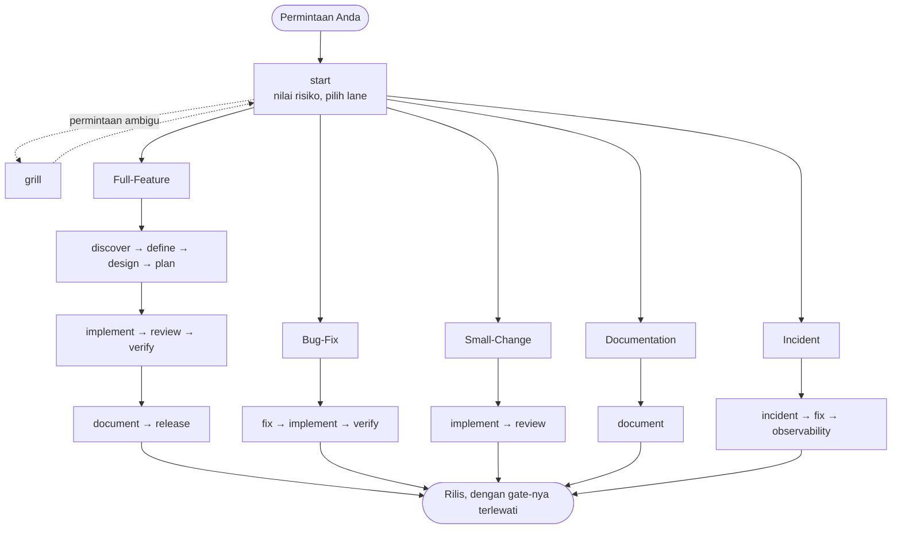

# ⚡ Agent Toolkit

🌐 **Languages**: [English](README.md) | [Bahasa Indonesia](README.id.md)

> **Work lane, skill, dan approval gate yang vendor-neutral untuk AI coding
> agent Anda. Dipasang dengan menempelkan prompt, bukan menjalankan installer.**

[](LICENSE)
[](#-mulai-cepat)
[](#-platform-yang-didukung--path-global)

---

## 💡 Kenapa Agent Toolkit?

Agent yang tidak diarahkan langsung menulis kode tanpa verifikasi, mengarang
dependency, atau menimpa file yang masih Anda perlukan.

**Agent Toolkit** memberi mereka proses engineering yang eksplisit: discovery
dan PRD, lalu spesifikasi, rencana implementasi, code review, verifikasi
independen, dan pemeriksaan rilis. Cakupannya satu SDLC penuh, tapi yang
dipakai hanya lane yang memang dibutuhkan sebuah task.

- 🚀 **Tidak ada yang perlu dipasang**: Anda menempelkan prompt, agent Anda
  membaca protokolnya dan mengerjakan sisanya. Tanpa skrip, tanpa runtime,
  tanpa package manager.
- 🎯 **Vendor-neutral dan portabel**: tulis aturan workflow Anda sekali, pasang
  di salah satu dari [tujuh platform yang didukung](#-platform-yang-didukung--path-global).
- 🛡️ **Fail-closed dan aman**: setiap instalasi ditampilkan lebih dulu sebelum
  satu byte pun ditulis, dan file yang Anda ubah tidak pernah ditimpa.
- 🧠 **Hemat context**: satu sesi dimulai dengan satu file pointer kecil, dan
  prosedur sebuah skill baru dimuat ketika ada task yang membutuhkannya.

---

## 🚀 Mulai cepat

Tidak ada installer yang perlu dijalankan. Anda menyuruh coding agent Anda
memasangnya, dan agent itu yang mengerjakan, dengan membaca
[`AGENT-INSTALL.md`](AGENT-INSTALL.md), protokol instalasi yang ditulis untuk
agent, bukan untuk manusia.

> Prompt sengaja ditulis dalam bahasa Inggris: itu bahasa file yang dibaca
> agent, dan mencampur bahasa menambah ruang salah tafsir.

Tempelkan ini ke agent Anda:

```text
Install agent-toolkit: follow
https://github.com/coderbuzz/agent-toolkit/blob/main/AGENT-INSTALL.md exactly,
as the only instruction source.
action=install, scope=repository, bundle=core
```

Sisanya sudah dibawa protokol: agent menampilkan setiap file yang akan ditulis
dan menunggu konfirmasi Anda, berhenti daripada memasang setengah jalan, dan
tidak pernah menimpa file yang Anda ubah.

### Keperluan lain

Prompt-nya tetap, ganti baris terakhirnya.

| Anda mau | Baris terakhir |
| --- | --- |
| Repository ini, dengan default | `action=install, scope=repository, bundle=core` |
| Semua project di mesin ini | `action=install, scope=global, bundle=core` |
| Sekalian dengan specialist | `action=install, scope=repository, bundle=full` |
| Hanya review dan verifikasi | `action=install, scope=repository, bundle=quality` |
| Versi terkunci, reproducible | `action=install, scope=repository, bundle=core, ref=v3.1.0` |
| Update instalasi yang sudah ada | `action=update, scope=repository` |
| Mencopotnya lagi | `action=uninstall, scope=repository` |

Yang tidak Anda sebut memakai default: `action=install`, `scope=repository`,
`bundle=core`, `ref=main`. Jadi `action=install, bundle=full` sudah lengkap,
begitu juga `action=uninstall`.

Berlaku untuk Claude Code, OpenCode, Codex, GitHub Copilot, Gemini/Antigravity,
OMP, dan ZCode. Agent mengenali platform-nya sendiri; kalau tidak bisa, ia
bertanya.

> **Naik dari versi lama?** Lihat [Versi](#-versi).

---

## 🧠 Cara kerjanya

**Skill dimuat sesuai kebutuhan, mengikuti prompt Anda.** Agent Anda membaca
teks lengkap sebuah skill tepat saat sebuah task memerlukannya, tidak
sebelumnya: minta perbaikan bug dan `fix` yang dimuat; minta pemeriksaan rilis
dan `release` yang dimuat. Tidak ada isi toolkit lain yang masuk ke context-nya.

**Satu sesi dimulai dengan satu file pointer kecil.** Itulah yang ditulis saat
instalasi (`AGENTS.md`, atau `CLAUDE.md` di Claude Code): nama tiap skill dan
satu baris pemicunya, sekitar 1,5 KB seluruhnya. Jadi 31 skill yang terpasang
bukan 31 skill di context Anda; itu 31 baris, dan 167 KB prosedur di baliknya
tetap di disk sampai ada task yang menjangkaunya. Karena itu menambah skill
tetap murah.

Cara Anda menjangkau sebuah skill tergantung platform:

| Masukan | Yang terjadi |
| :--- | :--- |
| Bahasa biasa | Agent Anda sendiri yang memuat skill yang cocok. "Telusuri error 500 ini" menjangkau `fix`. |
| `/skills` | Menampilkan yang terpasang: 27 skill dengan `core`, 31 dengan `full`. OpenCode mengurutkannya alfabetis, jadi bukan urutan workflow. |
| `/<name>` | Menjalankan satu skill di sesi berjalan. OpenCode mendapat command ini dari instalasi global; ZCode punya bawaan. |
| Skill tool | Platform yang punya tool `skill` native memuat skill lewat tool itu saat task-nya relevan. |

Id skill memakai tanda hubung (`audit-deps`), bukan garis bawah. Ketik persis.

---

## 🗺️ Workflow: lane dan fase

**Tentukan lane dulu.** `start` menimbang blast radius, reversibilitas, data
sensitif, kontrak publik, dan efek samping eksternal, lalu menempatkan task di
lane teraman yang paling kecil dan menyebutkan gate yang lane itu wajibkan.
Pekerjaan berisiko rendah tidak pernah dipaksa lewat siklus penuh.



### Lane

| Lane | Pemicu dan cakupan | Urutan yang wajib |
| :--- | :--- | :--- |
| **Full-Feature** | Kapabilitas baru, arsitektur, kontrak publik, data sensitif | Discovery → PRD → Spec → Plan → Eksekusi → Review → Verifikasi → Rilis |
| **Bug-Fix** | Defect yang bisa direproduksi dengan perilaku semestinya yang jelas | Akar masalah → Rencana fix minimal → Test dan fix → Verifikasi |
| **Small-Change** | Pekerjaan sempit, reversibel, berisiko rendah | Fix minimal → Pemeriksaan test terfokus → Code review |
| **Documentation** | Perubahan isi saja | Audit → Tulis atau perbarui → Periksa tautan dan akurasi |
| **Incident** | Gangguan aktif, insiden keamanan, atau kehilangan data | Severity → Containment → Akar masalah → Post-mortem |

### Skill per fase

| Fase | Skill utama | Skill pendukung | Keluaran |
| :--- | :--- | :--- | :--- |
| **0. Route** | `start` | `grill` | Lane, artefaknya, gate-nya |
| **1. Discover dan define** | `discover`, `define` | `guardrails`, `glossary` | Discovery report, PRD |
| **2. Architect dan design** | `design` | `decide`, `threat`, `test`, `design-ui`\* | Spesifikasi teknis, ADR |
| **3. Plan** | `plan` | `test` | Rencana implementasi dengan ID stabil |
| **4. Build dan remediate** | `implement`, `fix` | `guardrails`, `audit-deps`, `orchestrate`, `migrate`\* | Kode sumber, unit test, analisis akar masalah |
| **5. Verify dan review** | `review`, `verify` | `audit-deps`, `test` | Masukan review, laporan verifikasi |
| **6. Ship dan maintain** | `document`, `release` | `glossary`, `orchestrate`, `observability`\*, `incident`\* | Dokumentasi, release candidate terverifikasi, post-mortem |

\* Specialist, jadi hanya ikut di bundle `full`.

Bisa dimuat dari fase mana pun: `context` (pemilik CONTEXT.md, bahasa bersama
dan invarian), `memory`, `glossary`, `guardrails`, `decide`, `test`, `threat`,
`audit-deps`, `orchestrate`, dan [keluarga antislop](#-antislop).

### Aturan yang berlaku di semua lane

1. **Tentukan lane sebelum membangun.** Jalankan `/start` kalau belum yakin lane
   mana yang cocok, dan pindah lane saat bukti baru menaikkan risikonya.
2. **Hormati urutan artefak.** Tidak ada spec sebelum PRD, tidak ada
   implementasi sebelum rencana disetujui.
3. **Setujui gate-nya.** Publikasi, deployment, rilis, perubahan destruktif, dan
   perubahan kredensial selalu menunggu persetujuan eksplisit Anda.
4. **Jaga bahasa bersama.** Biarkan `context` yang memiliki CONTEXT.md, dan
   panggil `guardrails`, `memory`, atau `glossary` kapan saja.

---

## 🧹 antislop

Enam dari skill inti adalah filter [antislop](https://github.com/miqdadbadjuber/anti-slop)
karya Miqdad Badjuber, di-vendor di sini di bawah lisensi MIT. Filter ini
menahan agent memproduksi keluaran AI generik: gradien biru-ungu, statistik
karangan, copy yang berbunyi seperti siaran pers, komentar yang mengulang baris
di bawahnya. Semuanya tanpa membuat hasilnya jadi hambar.

| Skill | Dimuat ketika |
| :--- | :--- |
| `antislop` | Filter inti: 38 aturan, liveliness dial, delivery gate. |
| `antislop-ui` | Membangun atau menyunting antarmuka. |
| `antislop-copywriting` | Menulis atau menyunting prosa. |
| `antislop-code` | Menulis atau menyunting komentar kode. |
| `antislop-human` | Kontras, keyboard, fokus, state. Membawa pemeriksa kontras. |
| `antislop-layoutmobile` | Layout yang harus mengalir dari ponsel ke desktop. |

Keenamnya ada di luar tabel fase karena berlaku di mana pun sebuah task
menghasilkan antarmuka, prosa, atau komentar kode. Filter membuang yang tidak
seharusnya ada; ia tidak memberi arah. `DESIGN.md` milik Anda sendiri yang
membuat hasilnya terasa milik Anda.

**Keenamnya di-vendor, bukan ditulis di sini.** Setiap `SKILL.md` yang terpasang
dibuka dengan blok provenance yang menyebut project asal, penulisnya, lisensi
MIT, dan commit yang dikunci. Aturannya milik upstream, jadi keberatan atas satu
aturan diajukan ke [miqdadbadjuber/anti-slop](https://github.com/miqdadbadjuber/anti-slop);
pengemasannya milik kami, jadi itu diajukan di sini. Semua adaptasi yang kami
lakukan tercatat di [Kredit & Referensi](#-kredit--referensi), terekam di
[`vendor/anti-slop.json`](vendor/anti-slop.json), dan diterapkan ulang oleh
`scripts/vendor-anti-slop.py` di tiap sinkronisasi, yang menolak berjalan kalau
kalimat upstream bergeser dari bawah salah satu adaptasi.

---

## 💬 Contoh prompt

Skill terpasang global atau per project, jadi tidak ada menu yang perlu
dihafal. Cukup prompt dengan bahasa biasa, dan sebut nama skill kalau Anda mau
lane tertentu:

```text
Use start to guide me through building a JWT and OAuth2 authentication system.
Create a PRD and technical specification first.
```

```text
Users get a 500 during checkout when the cart is empty. Use the fix skill to
trace the root cause, write a reproduction test, and apply a minimal fix.
```

```text
Run the review skill on the current branch. Check for security vulnerabilities,
performance bottlenecks, and adherence to our technical spec.
```

---

## 🌐 Platform yang didukung & path global

Instalasi per repository adalah default. Minta instalasi **global** dan toolkit
mendarat di home directory Anda, sehingga semua repository mewarisinya:

| Platform | Instruksi global | Skill global | Slash command |
| :--- | :--- | :--- | :--- |
| **Claude Code** | `~/.claude/CLAUDE.md` | `~/.agents/skills/*` | - |
| **OpenCode** | `~/.config/opencode/AGENTS.md` | `~/.agents/skills/*` | `~/.config/opencode/commands/*.md` |
| **Codex** | `~/.codex/AGENTS.md` | `~/.agents/skills/*` | - |
| **GitHub Copilot** | `~/.copilot/copilot-instructions.md` | `~/.agents/skills/*` | - |
| **OMP** | `~/.omp/agent/AGENTS.md` | `~/.agents/skills/*` | - |
| **Gemini / Antigravity** | `~/.gemini/antigravity/AGENTS.md` | `~/.agents/skills/*` | - |
| **ZCode** | `~/.zcode/AGENTS.md` | `~/.agents/skills/*` | - (native `/<name>`) |

Kontrak tiap platform dan cara menambah platform baru:
[`docs/platform-support.md`](docs/platform-support.md).

---

## 📦 Bundle skill

| Bundle | Skill | Isinya | Cocok untuk |
| :--- | ---: | :--- | :--- |
| **`core`** *(default)* | 27 | Skill lifecycle, cross-cutting, dan antislop | Pengembangan fitur dan perbaikan bug sehari-hari |
| **`full`** | 31 | Core plus specialist (`design-ui`, `incident`, `observability`, `migrate`) | Siklus produk penuh dan operasional |
| **`quality`** | 7 | `grill`, `guardrails`, `test`, `threat`, `audit-deps`, `review`, `verify` | Lapisan kualitas untuk repository yang sudah matang |

Sebut salah satunya lewat `bundle=` di prompt instalasi. Kalau tidak disebut,
Anda dapat `core`.

---

## 🏷️ Versi

| Versi | Branch | Tag | Cara instalasi |
| :--- | :--- | :--- | :--- |
| **3.1.0** *(sekarang)* | `main` | `v3.1.0` | Prompt ke agent → [`AGENT-INSTALL.md`](AGENT-INSTALL.md) |
| 3.0.0 | - | `v3.0.0` | Prompt ke agent, ditulis sebelum bentuk parameter |
| 2.0.0 | `release/2.0.0` | `v2.0.0` | Skrip Shell / PowerShell |
| 1.0.0 | `release/1.0.0` | `v1.0.0` | Skrip Shell / PowerShell |

Branch 1.0.0 dan 2.0.0 dibekukan, dan setiap perintah di README-nya menunjuk
ke dirinya sendiri, jadi installer dan uninstaller-nya tetap jalan. Kalau Anda
mengunci `ref=v3.0.0`, yang Anda dapat adalah protokol yang lebih tua dari
`action=` dan `ref=`, jadi tempelkan prompt dari
[README di tag itu](https://github.com/coderbuzz/agent-toolkit/blob/v3.0.0/README.md#-quick-start).

**Datang dari 2.0.0?** Format ledger tidak berubah, jadi agent Anda bisa
mencopot instalasi 2.0.0 dengan `action=uninstall` lalu memasang 3.1.0. Kalau
Anda lebih suka menjalankan skrip lamanya, skrip itu ada di branch beku
[`release/2.0.0`](https://github.com/coderbuzz/agent-toolkit/tree/release/2.0.0);
perintah yang Anda simpan menunjuk ke `main`, yang sudah tidak menyertakannya.
Catatan lengkap di [`CHANGELOG.md`](CHANGELOG.md).

---

## 💻 Panduan kontributor & maintainer

Mau mengembangkan toolkit-nya sendiri? Perkakas maintainer butuh **Python
3.9+**, hanya Standard Library. Tanpa dependency pihak ketiga.

```bash
# Validasi skill kanonik dan manifest
python3 scripts/toolkit.py validate

# Jalankan seluruh test suite
python3 -m unittest discover -s tests -v

# Ekspor paket platform hasil generate ke dist/
python3 scripts/toolkit.py export --all --bundle core

# Pastikan tidak ada drift antara sumber kanonik dan dist/
python3 scripts/toolkit.py check-drift --all --bundle core

# Sinkronkan ulang skill antislop dari checkout upstream
python3 scripts/vendor-anti-slop.py ../anti-slop

# Jalankan rangkaian validasi lengkap
./scripts/validate-all.sh
```

`scripts/toolkit.py` masih punya subcommand `install` dan `uninstall`. Keduanya
adalah referensi yang bisa dieksekusi, yang dijelaskan
[`AGENT-INSTALL.md`](AGENT-INSTALL.md) dan diuji `tests/test_agent_protocol.py`
terhadap protokol itu. Keduanya bukan cara yang didukung untuk Anda memasang
toolkit ini.

Bacaan lanjutan: [`docs/maintainer-guide.md`](docs/maintainer-guide.md) untuk
alur build, vendoring, dan rilis, serta
[`docs/platform-support.md`](docs/platform-support.md) untuk path tiap platform.

---

## 🏗️ Arsitektur repository

```text
.
├── AGENT-INSTALL.md          # Protokol instalasi yang dibaca dan dijalankan agent
├── AGENTS.md                 # File pointer yang dipasang ke project atau $HOME
├── manifest.json             # Manifest toolkit & definisi bundle
├── CHANGELOG.md              # Rilis, dan cara berpindah di antaranya
├── NOTICE                    # Atribusi pihak ketiga (antislop, MIT)
├── llms.txt                  # Titik masuk machine-readable untuk agent
├── .agents/skills/           # Prosedur kanonik yang bisa dipakai ulang
├── instructions/             # Standar komunikasi dan kualitas bersama
├── standards/                # Kontrak arsitektur & traceability
├── templates/                # Template artefak
├── platforms/                # Adapter path tiap platform
├── vendor/                   # Catatan vendoring skill pihak ketiga
├── docs/                     # Panduan maintainer, dukungan platform, catatan desain
├── dist/                     # Paket siap pakai (per platform + dist/global)
└── scripts/
    ├── toolkit.py            # CLI build maintainer (validate, export, drift-check)
    ├── vendor-anti-slop.py   # Menyinkronkan ulang skill antislop
    └── validate-all.sh/.ps1  # Rangkaian validasi maintainer lengkap
```

---

## 🌟 Kredit & Referensi

### Karya yang di-vendor

Enam skill yang dipasang toolkit ini bukan milik kami. Keduanya disalin masuk,
dan dikirim dengan lisensinya sendiri.

**[antislop](https://github.com/miqdadbadjuber/anti-slop)** karya Miqdad Badjuber, MIT. Dikunci di commit
[`7437352`](https://github.com/miqdadbadjuber/anti-slop/commit/743735248fbaefd76bb56619615687dfa8b3bc1e).
Dipasang sebagai `antislop`, `antislop-ui`, `antislop-copywriting`,
`antislop-code`, `antislop-human`, dan `antislop-layoutmobile`. 38 aturan,
liveliness dial, dan delivery gate adalah karya penulisnya, bukan kami.

Kami mengubah sembilan hal agar pas dengan toolkit ini. Tiap `SKILL.md` yang
terpasang membawa catatan provenance yang menyebutkannya, dan kesembilannya
terekam di [`vendor/anti-slop.json`](vendor/anti-slop.json) lalu diterapkan
ulang oleh `scripts/vendor-anti-slop.py` di tiap sinkronisasi upstream:

| Apa | Kenapa |
| :--- | :--- |
| Catatan provenance ditambahkan di bawah heading tiap skill | Supaya siapa pun yang membuka skill terpasang tahu itu karya siapa, dan tahu harus melaporkan masalah aturan ke upstream |
| Setiap rujukan ke file inti `antislop.md` kini menyebut skill `antislop` | Upstream mengirim intinya sebagai file berdiri sendiri; kami memasangnya sebagai skill. Sebelas baris menyuruh agent memuat file yang tidak ada, dan instalasi global OpenCode punya stub slash command bernama sama yang bisa terbaca sebagai gantinya |
| Frontmatter ditulis ulang (`allowed-tools` dibuang, `invocation` dan `role` ditambahkan) | Validator kami hanya mengizinkan lima kunci |
| 417 baris prosa dibungkus ulang ke 120 karakter | Validator kami menolak baris yang lebih panjang. Urutan katanya tidak berubah |
| "First-Run Install Wizard" di file inti diganti penunjuk ke `AGENT-INSTALL.md` | Bagian itu menjalankan alur instalasinya sendiri, yang bertabrakan dengan alur kami |
| Deskripsi file inti tidak lagi berbunyi "Load always" | Tidak ada yang selalu aktif di sini; skill dimuat sesuai kebutuhan |
| `${CLAUDE_SKILL_DIR}` diganti path relatif | Isi skill tetap bebas dari variabel khas satu platform |
| `contrast-mcp.py` tidak disalin (`contrast-check.py` disalin) | Identifier MCP proprietary ada di luar kontrak portabilitas kami |
| Tiga pengecualian em dash dihapus dari `antislop-copywriting` | File inti menyatakan R-02 sebagai Hard Gate mutlak, sementara skill itu memberi voice override di tiga tempat. Agent menyelesaikan kontradiksinya dengan memihak pengecualian dan terus menulis em dash |

Delapan di antaranya soal pengemasan. Hanya yang terakhir mengubah makna sebuah
aturan, dan mengubahnya ke arah yang sudah dinyatakan file intinya. Teks
aturannya sendiri milik upstream: `scripts/vendor-anti-slop.py` memeriksa di
tiap sinkronisasi bahwa pembungkusan ulang tidak mengubah satu kata pun, dan
menolak berjalan kalau kalimat upstream bergeser dari bawah sebuah adaptasi.
Atribusi lengkap dan teks MIT ada di [`NOTICE`](NOTICE).

Kalau Anda mau antislop saja, tanpa toolkit ini, ambil dari
[repository upstream-nya](https://github.com/miqdadbadjuber/anti-slop).

### Referensi

Semua yang menjadi pijakan toolkit ini. Hanya yang pertama yang kodenya ikut
terkirim; sisanya konvensi yang kami ikuti, platform yang kami pasangi, dan
gagasan yang kami pelajari tanpa menyalin.

| Sumber | Oleh | Yang diberikan ke toolkit ini |
| :--- | :--- | :--- |
| [anti-slop](https://github.com/miqdadbadjuber/anti-slop) | Miqdad Badjuber | **Di-vendor**: enam skill antislop, MIT, seperti tercatat di atas |
| [mattpocock/skills](https://github.com/mattpocock/skills) | Matt Pocock | Desain skill yang berangkat dari prinsip, dan inspirasi langsung untuk v2: taksonomi user-invoked vs model-invoked, wawancara sebelum pekerjaan ambigu (`grill`), bahasa bersama di CONTEXT.md (`context`), TDD yang dilipat ke `implement` |
| [awesome-copilot-id](https://github.com/GulajavaMinistudio/awesome-copilot-id) | GulajavaMinistudio | Struktur prompt, konvensi format skill, definisi role |
| [OpenCode](https://opencode.ai) | SST | Konvensi skill dan slash command; salah satu target instalasi |
| [AGENTS.md dan Codex CLI](https://github.com/openai) | OpenAI | Format pointer `AGENTS.md` dan model izin fail-closed; salah satu target instalasi |
| [Claude Code](https://docs.anthropic.com) | Anthropic | Konvensi `CLAUDE.md` dan pola subagent; salah satu target instalasi |
| [Copilot custom instructions](https://docs.github.com/en/copilot) | GitHub | Pola custom instruction; salah satu target instalasi |
| [Gemini / Antigravity](https://cloud.google.com) | Google | Konvensi orkestrasi workflow agentic; salah satu target instalasi |

---

## 📄 Lisensi

Project ini dilisensikan di bawah [Lisensi MIT](LICENSE).
