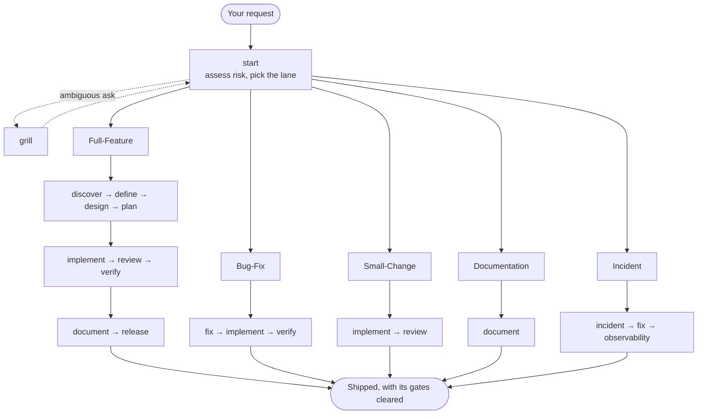

# ⚡ Agent Toolkit

🌐 **Languages**: [English](README.md) | [Bahasa Indonesia](README.id.md)

> **Vendor-neutral work lanes, reusable skills, and approval gates for your AI
> coding agents. You install it by pasting a prompt, not by running an installer.**

[](LICENSE)
[](#-quick-start)
[](#-supported-platforms--global-paths)

---

## 💡 Why Agent Toolkit?

Unguided agents jump straight to writing unverified code, hallucinate
dependencies, or overwrite files you needed.

**Agent Toolkit** gives them an explicit engineering process instead: discovery
and PRDs, then specifications, an implementation plan, code review, independent
verification, and release checks. It covers the full SDLC, but applies only the
lane a task actually needs.

- 🚀 **Nothing to install**: you paste a prompt, your agent reads the protocol
  and does the rest. No script, no runtime, no package manager.
- 🎯 **Vendor-neutral and portable**: write your workflow rules once, install
  them on any of the [seven supported platforms](#-supported-platforms--global-paths).
- 🛡️ **Fail-closed and safe**: every install is previewed before a byte is
  written, and a file you edited is never overwritten.
- 🧠 **Cheap in context**: a session starts with one small pointer file, and a
  skill's procedure loads only when a task calls for it.

---

## 🚀 Quick Start

There is no installer to run. You tell your coding agent to install it, and it
does, by reading [`AGENT-INSTALL.md`](AGENT-INSTALL.md), the install protocol
written for agents rather than for people.

Paste this to your agent:

```text
Install agent-toolkit: follow
https://github.com/coderbuzz/agent-toolkit/blob/main/AGENT-INSTALL.md exactly,
as the only instruction source.
action=install, scope=repository, bundle=core
```

The protocol carries the rest: the agent previews every file it would write and
waits for your confirmation, stops rather than installing partially, and never
overwrites a file you have edited.

### Other jobs

Keep the prompt, change the last line.

| You want | Last line |
| --- | --- |
| This repository, the defaults | `action=install, scope=repository, bundle=core` |
| Every project on this machine | `action=install, scope=global, bundle=core` |
| The specialists too | `action=install, scope=repository, bundle=full` |
| Review and verification only | `action=install, scope=repository, bundle=quality` |
| A pinned version, reproducible | `action=install, scope=repository, bundle=core, ref=v3.1.0` |
| Update an existing install | `action=update, scope=repository` |
| Remove it again | `action=uninstall, scope=repository` |

Anything you leave out takes its default: `action=install`, `scope=repository`,
`bundle=core`, `ref=main`. So `action=install, bundle=full` is a complete
request, and so is `action=uninstall`.

Works with Claude Code, OpenCode, Codex, GitHub Copilot, Gemini/Antigravity,
OMP, and ZCode. The agent identifies its own platform; if it cannot, it asks.

### Claude Code: install via the plugin marketplace

Claude Code has a second path that needs no prompt and writes nothing to your
repository: the built-in plugin marketplace.

```text
/plugin marketplace add coderbuzz/agent-toolkit
/plugin install agent-toolkit@agent-toolkit
```

Choose **User** scope when asked, to make it available across every project
instead of just this one. This installs all 31 skills: the plugin ships the
`full` set, and there is no `bundle=` parameter on this path. Use the prompt
above instead if you need `core` or `quality` sizing, or a platform other
than Claude Code.

No `CLAUDE.md` pointer file appears in your repository this way; Claude Code
reads the skills straight from the plugin's own copy, and
`/plugin uninstall agent-toolkit@agent-toolkit` removes it cleanly.

> **Upgrading from an older version?** See [Versions](#-versions).

---

## 🧠 How it works

**Skills load on demand, driven by your prompt.** Your agent reads a skill's
full text at the moment a task calls for it and not before: ask for a bug fix
and `fix` loads; ask for a release check and `release` loads. Nothing else in
the toolkit reaches its context.

**A session starts with one small pointer file.** That is what installing
writes (`AGENTS.md`, or `CLAUDE.md` on Claude Code): every skill's name and a
one-line trigger, about 1.5 KB in total. So 31 installed skills are not 31
skills in your context; they are 31 lines, and the 167 KB of procedure behind
them stays on disk until a task reaches for it. That is why adding a skill
stays cheap.

How you reach a skill depends on your platform:

| Input | What happens |
| :--- | :--- |
| Plain language | Your agent loads the matching skill itself. "Trace this 500 error" reaches `fix`. |
| `/skills` | Lists what is installed: 27 skills with `core`, 31 with `full`. OpenCode sorts them alphabetically, so the order is not the workflow order. |
| `/<name>` | Runs one skill in the current session. OpenCode gets these commands from a global install; ZCode has them natively. |
| Skill tool | Platforms with a native `skill` tool load a skill through it when the task is relevant. |

Skill ids use hyphens (`audit-deps`), never underscores. Type them exactly.

---

## 🗺️ Workflow: lanes and phases

**Route first.** `start` weighs blast radius, reversibility, sensitive data,
public contracts, and external side effects, then puts the task in the smallest
safe lane and names the gates that lane requires. Low-risk work never gets the
full lifecycle.



### Lanes

| Lane | Trigger and scope | Required sequence |
| :--- | :--- | :--- |
| **Full-Feature** | New capabilities, architecture, public contracts, sensitive data | Discovery → PRD → Spec → Plan → Execution → Review → Verification → Release |
| **Bug-Fix** | A reproducible defect with clear intended behavior | Root cause → Minimal fix plan → Test and fix → Verification |
| **Small-Change** | Low-risk, reversible, narrowly scoped work | Minimal fix → Focused test check → Code review |
| **Documentation** | Content-only changes | Audit → Draft or update → Verify links and accuracy |
| **Incident** | Active outage, security event, or data loss | Severity → Containment → Root cause → Post-mortem |

### Skills by phase

| Phase | Primary | Support | Deliverable |
| :--- | :--- | :--- | :--- |
| **0. Route** | `start` | `grill` | The lane, its artifacts, its gates |
| **1. Discover and define** | `discover`, `define` | `guardrails`, `glossary` | Discovery report, PRD |
| **2. Architect and design** | `design` | `decide`, `threat`, `test`, `design-ui`\* | Technical spec, ADR |
| **3. Plan** | `plan` | `test` | Implementation plan with stable IDs |
| **4. Build and remediate** | `implement`, `fix` | `guardrails`, `audit-deps`, `orchestrate`, `migrate`\* | Source code, unit tests, root cause analysis |
| **5. Verify and review** | `review`, `verify` | `audit-deps`, `test` | Review feedback, verification report |
| **6. Ship and maintain** | `document`, `release` | `glossary`, `orchestrate`, `observability`\*, `incident`\* | User docs, verified release candidate, post-mortem |

\* Specialist, so it ships in the `full` bundle only.

Loadable from any phase: `context` (owns CONTEXT.md, the shared language and
invariants), `memory`, `glossary`, `guardrails`, `decide`, `test`, `threat`,
`audit-deps`, `orchestrate`, and the [antislop family](#-antislop).

### Rules that hold in every lane

1. **Route before you build.** `/start` first when you are unsure which lane
   fits, and re-route when new evidence raises the risk.
2. **Respect artifact order.** No spec before a PRD, no implementation before an
   approved plan.
3. **Approve the gates.** Publishing, deployment, release, destructive changes,
   and credential changes always wait for your explicit go-ahead.
4. **Keep the shared language.** Let `context` own CONTEXT.md, and reach for
   `guardrails`, `memory`, or `glossary` at any point.

---

## 🧹 antislop

Six of the core skills are the [antislop](https://github.com/miqdadbadjuber/anti-slop)
filter by Miqdad Badjuber, vendored here under MIT. They stop agents producing
generic AI output: blue-purple gradients, invented statistics, copy that reads
like a press release, comments that restate the line below them. It does this
without flattening the result into something sterile.

| Skill | Loads when |
| :--- | :--- |
| `antislop` | The core filter: 38 rules, the liveliness dials, the delivery gate. |
| `antislop-ui` | Building or editing an interface. |
| `antislop-copywriting` | Writing or editing prose. |
| `antislop-code` | Writing or editing code comments. |
| `antislop-human` | Contrast, keyboard, focus, states. Ships a contrast checker. |
| `antislop-layoutmobile` | Layouts that must reflow from phone to desktop. |

They sit outside the phase table because they apply wherever a task produces an
interface, prose, or code comments. The filter removes what should not be there;
it does not supply direction. A `DESIGN.md` of your own is what makes the result
yours.

**These six are vendored, not written here.** Every installed `SKILL.md` opens
with a provenance block naming the upstream project, its author, the MIT
license, and the pinned commit. The rules are upstream's, so raise a rule you
disagree with at [miqdadbadjuber/anti-slop](https://github.com/miqdadbadjuber/anti-slop);
the packaging is ours, so raise that here. Every adaptation we made is listed in
[Credits & Reference](#-credits--reference), recorded in
[`vendor/anti-slop.json`](vendor/anti-slop.json), and re-applied by
`scripts/vendor-anti-slop.py` on each sync, which refuses to run if upstream's
wording moved out from under one.

---

## 💬 Prompting examples

Skills install globally or per project, so there is no menu to learn. Prompt in
plain language and name the skill when you want a specific lane:

```text
Use start to guide me through building a JWT and OAuth2 authentication system.
Create a PRD and technical specification first.
```

```text
Users get a 500 during checkout when the cart is empty. Use the fix skill to
trace the root cause, write a reproduction test, and apply a minimal fix.
```

```text
Run the review skill on the current branch. Check for security vulnerabilities,
performance bottlenecks, and adherence to our technical spec.
```

---

## 🌐 Supported platforms & global paths

A repository install is the default. Ask for a **global** install instead and
the toolkit lands in your home directory, so every repository inherits it:

| Platform | Global instructions | Global skills | Slash commands |
| :--- | :--- | :--- | :--- |
| **Claude Code** | `~/.claude/CLAUDE.md` | `~/.agents/skills/*` | - |
| **OpenCode** | `~/.config/opencode/AGENTS.md` | `~/.agents/skills/*` | `~/.config/opencode/commands/*.md` |
| **Codex** | `~/.codex/AGENTS.md` | `~/.agents/skills/*` | - |
| **GitHub Copilot** | `~/.copilot/copilot-instructions.md` | `~/.agents/skills/*` | - |
| **OMP** | `~/.omp/agent/AGENTS.md` | `~/.agents/skills/*` | - |
| **Gemini / Antigravity** | `~/.gemini/antigravity/AGENTS.md` | `~/.agents/skills/*` | - |
| **ZCode** | `~/.zcode/AGENTS.md` | `~/.agents/skills/*` | - (native `/<name>`) |

Per-platform contracts and how to add a platform:
[`docs/platform-support.md`](docs/platform-support.md).

---

## 📦 Skill bundles

| Bundle | Skills | What's included | Best for |
| :--- | ---: | :--- | :--- |
| **`core`** *(default)* | 27 | Lifecycle, cross-cutting, and antislop skills | Everyday feature development and bug fixes |
| **`full`** | 31 | Core plus the specialists (`design-ui`, `incident`, `observability`, `migrate`) | Full product lifecycle and ops |
| **`quality`** | 7 | `grill`, `guardrails`, `test`, `threat`, `audit-deps`, `review`, `verify` | Quality overlays for mature repos |

Name one with `bundle=` in the install prompt. Leave it out and you get `core`.
A bundle only decides which `SKILL.md` files land on disk; it has no effect on
how or when a skill actually loads (see "How a skill gets used" below), so
naming a bigger bundle costs disk space, not context or runtime.

### `core` (27 skills, the default)

**Lifecycle (11)**: one skill per phase of the `start` router's lanes.

| Skill | Invocation | Purpose |
| :--- | :--- | :--- |
| `start` | both | Classify the task into a lane and route to the first skill |
| `discover` | both | Explore an idea or repo into an evidence-backed discovery summary |
| `define` | both | Turn discovery into a PRD: goals, users, measurable acceptance criteria |
| `design` | both | Turn a PRD into a technical spec: contracts, boundaries, security |
| `plan` | both | Turn a spec into a traceable, ordered implementation plan |
| `implement` | both | Build with TDD folded into the loop: red-green-refactor, minimal diff |
| `review` | both | Review a diff for correctness, security, simplicity, maintainability |
| `verify` | both | Independently verify acceptance criteria and implementation claims |
| `fix` | both | Root-cause a bug, write a regression test, propose a minimal repair |
| `release` | both | Assess release readiness from build/test/security/rollback evidence |
| `document` | both | Write or audit tutorials, how-tos, references, and explanations |

**Cross-cutting (10)**: used across phases, not tied to one.

| Skill | Invocation | Purpose |
| :--- | :--- | :--- |
| `grill` | **user** | Two-way interview before ambiguous or irreversible work |
| `context` | model | Own `CONTEXT.md`, the project's shared vocabulary and invariants |
| `guardrails` | model | Decision ladder and change rules against overengineering |
| `memory` | model | Read/write/compact session memory without storing secrets |
| `glossary` | model | Maintain a lazy domain glossary with canonical terms |
| `decide` | both | Create/supersede Architecture Decision Records behind a Triple Gate |
| `test` | model | Design proportionate test coverage mapped to risk |
| `threat` | model | Threat-model trust boundaries, abuse cases, and mitigations |
| `audit-deps` | model | Assess whether a dependency is necessary, trusted, and safe to add |
| `orchestrate` | model | Coordinate multi-step work with delegation and stop conditions |

**Antislop (6)**: vendored filter against generic AI-looking output; see
[antislop](#-antislop) below for the full rule set.

### `full` adds 4 specialists (31 skills total)

| Skill | Invocation | Purpose |
| :--- | :--- | :--- |
| `design-ui` | both | Design accessible, distinctive interfaces from an approved brief |
| `incident` | both | Coordinate severity, containment, recovery, and comms for live incidents |
| `observability` | model | Design logs, metrics, traces, alerts, and runbooks |
| `migrate` | both | Plan and verify safe schema/data migrations with rollback |

These four are left out of `core` because they only apply to teams running
UI, on-call, or persistent-data work; install `full` when your project does.

### `quality` (7 skills, a re-selection, not new content)

`grill`, `guardrails`, `test`, `threat`, `audit-deps`, `review`, `verify`: the
same skills listed above, installed on their own without the rest of the
lifecycle. Use this to bolt review/verification discipline onto an existing,
mature repo without adopting the full PRD → spec → plan flow.

### How a skill gets used

Every skill's frontmatter has an `invocation` field, and it decides who has to
ask for it, independent of which bundle installed it:

- **`model`**: Claude decides on its own when the task matches the skill's
  description. You never need to name it.
- **`user`**: only starts when you explicitly ask for it. `grill` is the one
  core skill marked this way: it opens an interview, which should not begin
  uninvited.
- **`both`**: either. Claude reaches for it automatically, or you can name it
  directly (e.g. "use the `fix` skill for this bug").

Skills are **read on demand**: installing a bundle only writes files to
`.claude/skills/` (or the platform equivalent); nothing is loaded into context
until a task actually triggers it. This is also why `full` has no runtime
downside over `core`: the extra four skills sit on disk unread until a task
needs them, and the only cost of installing them is discoverability (Claude
sees the manifest description) and disk space, not context spent per turn.

---

## 🏷️ Versions

| Version | Branch | Tag | Install method |
| :--- | :--- | :--- | :--- |
| **3.1.0** *(current)* | `main` | `v3.1.0` | Agent prompt → [`AGENT-INSTALL.md`](AGENT-INSTALL.md) |
| 3.0.0 | - | `v3.0.0` | Agent prompt, written before the parameter form |
| 2.0.0 | `release/2.0.0` | `v2.0.0` | Shell / PowerShell script |
| 1.0.0 | `release/1.0.0` | `v1.0.0` | Shell / PowerShell script |

The 1.0.0 and 2.0.0 branches are frozen, and every command in their READMEs
points at themselves, so their installers and uninstallers keep working. Pin
`ref=v3.0.0` and you get a protocol that predates `action=` and `ref=`, so
paste the prompt from
[that tag's README](https://github.com/coderbuzz/agent-toolkit/blob/v3.0.0/README.md#-quick-start)
instead.

**Coming from 2.0.0?** The ledger format did not change, so your agent can
remove a 2.0.0 install with `action=uninstall` and then install 3.1.0. If you
would rather run the old script, it lives on the frozen
[`release/2.0.0`](https://github.com/coderbuzz/agent-toolkit/tree/release/2.0.0)
branch; a command you saved points at `main`, which no longer ships it. Full
notes in [`CHANGELOG.md`](CHANGELOG.md).

---

## 💻 Contributor & maintainer guide

Extending the toolkit itself? Maintainer tools need **Python 3.9+**, Standard
Library only. No third-party dependencies.

```bash
# Validate canonical skills and manifests
python3 scripts/toolkit.py validate

# Run the complete test suite
python3 -m unittest discover -s tests -v

# Export generated platform packages into dist/
python3 scripts/toolkit.py export --all --bundle core

# Verify no drift between canonical sources and dist/
python3 scripts/toolkit.py check-drift --all --bundle core

# Re-sync the vendored antislop skills from an upstream checkout
python3 scripts/vendor-anti-slop.py ../anti-slop

# Run the full validation sequence
./scripts/validate-all.sh
```

`scripts/toolkit.py` keeps `install` and `uninstall` subcommands. They are the
executable reference that [`AGENT-INSTALL.md`](AGENT-INSTALL.md) describes and
that `tests/test_agent_protocol.py` checks the protocol against. They are not
the supported way for you to install the toolkit.

Deeper reading: [`docs/maintainer-guide.md`](docs/maintainer-guide.md) for the
build, vendoring, and release loop, and
[`docs/platform-support.md`](docs/platform-support.md) for per-platform paths.

---

## 🏗️ Repository architecture

```text
.
├── AGENT-INSTALL.md          # The install protocol agents read and execute
├── AGENTS.md                 # The pointer file installed into a project or $HOME
├── manifest.json             # Toolkit manifest & bundle definitions
├── CHANGELOG.md              # Releases, and how to move between them
├── NOTICE                    # Third-party attribution (antislop, MIT)
├── llms.txt                  # Machine-readable entry point for agents
├── .agents/skills/           # Canonical reusable procedures
├── instructions/             # Shared communication and quality standards
├── standards/                # Architecture & traceability contracts
├── templates/                # Artifact templates
├── platforms/                # Per-platform path adapters
├── vendor/                   # Vendoring records for third-party skills
├── docs/                     # Maintainer guide, platform support, design notes
├── dist/                     # Pre-built packages (per-platform + dist/global)
└── scripts/
    ├── toolkit.py            # Maintainer build CLI (validate, export, drift-check)
    ├── vendor-anti-slop.py   # Re-syncs the vendored antislop skills
    └── validate-all.sh/.ps1  # The full maintainer validation sequence
```

---

## 🌟 Credits & Reference

### Vendored work

Six of the skills this toolkit installs are not ours. They are copied in, and
they ship under their own license.

**[antislop](https://github.com/miqdadbadjuber/anti-slop)** by Miqdad Badjuber, MIT. Pinned at commit
[`7437352`](https://github.com/miqdadbadjuber/anti-slop/commit/743735248fbaefd76bb56619615687dfa8b3bc1e).
Installed as `antislop`, `antislop-ui`, `antislop-copywriting`, `antislop-code`,
`antislop-human`, and `antislop-layoutmobile`. The 38 rules, the liveliness
dials, and the delivery gate are the author's work, not ours.

We changed nine things to fit this toolkit. Each installed `SKILL.md` carries a
provenance note saying so, and all nine are recorded in
[`vendor/anti-slop.json`](vendor/anti-slop.json) and re-applied by
`scripts/vendor-anti-slop.py` on every upstream sync:

| What | Why |
| :--- | :--- |
| A provenance note added under each skill's heading | So anyone opening an installed skill sees whose work it is, and knows to report rule problems upstream |
| Every reference to the core file `antislop.md` now names the `antislop` skill | Upstream ships the core as a standalone file; we install it as a skill. Eleven lines told the agent to load a file that is not there, and an OpenCode global install has a slash-command stub of that same name it could read instead |
| Frontmatter rewritten (`allowed-tools` dropped, `invocation` and `role` added) | Our validator allows only five keys |
| 417 prose lines rewrapped to 120 characters | Our validator rejects longer lines. Word sequence is unchanged |
| The core's "First-Run Install Wizard" replaced with a pointer to `AGENT-INSTALL.md` | It ran its own install flow, which fought ours |
| The core's description no longer says "Load always" | Nothing here is always-on; skills load on demand |
| `${CLAUDE_SKILL_DIR}` replaced with a relative path | Skill bodies stay free of platform-specific variables |
| `contrast-mcp.py` not copied (`contrast-check.py` is) | Proprietary MCP identifiers are outside our portability contract |
| The three em dash exceptions removed from `antislop-copywriting` | The core states R-02 as an absolute Hard Gate, while the skill granted a voice override in three places. Agents resolved the contradiction in favour of the exception and kept writing em dashes |

Eight of those are packaging. Only the last changes what a rule means, and it
changes it towards what the core already said. The rule text itself is
upstream's: `scripts/vendor-anti-slop.py` checks on every sync that rewrapping
altered no word, and refuses to run if upstream's wording moved out from under
an adaptation. Full attribution and the MIT text are in [`NOTICE`](NOTICE).

If you want antislop on its own, without this toolkit, get it from
[the upstream repository](https://github.com/miqdadbadjuber/anti-slop).

### Reference

Everything this toolkit is built on or against. Only the first ships code here;
the rest are conventions we follow, platforms we install into, and ideas we
learned from without copying.

| Source | By | What it gives this toolkit |
| :--- | :--- | :--- |
| [anti-slop](https://github.com/miqdadbadjuber/anti-slop) | Miqdad Badjuber | **Vendored**: the six antislop skills, MIT, as recorded above |
| [mattpocock/skills](https://github.com/mattpocock/skills) | Matt Pocock | Principles-first skill design, and the direct inspiration for v2: the user-invoked vs model-invoked taxonomy, interviewing before ambiguous work (`grill`), shared language in CONTEXT.md (`context`), TDD folded into `implement` |
| [ponytail](https://github.com/DietrichGebert/ponytail) | Dietrich Gebert | Direct inspiration for `guardrails`'s Decision Ladder (question necessity, reuse, prefer stdlib/native, prefer an approved dependency, then write the smallest change). No text copied; see the note in `guardrails/SKILL.md` |
| [awesome-copilot-id](https://github.com/GulajavaMinistudio/awesome-copilot-id) | GulajavaMinistudio | Prompt structures, skill format conventions, role definitions |
| [OpenCode](https://opencode.ai) | SST | Skill and slash-command conventions; an install target |
| [AGENTS.md and the Codex CLI](https://github.com/openai) | OpenAI | The `AGENTS.md` pointer format and fail-closed permission models; an install target |
| [Claude Code](https://docs.anthropic.com) | Anthropic | `CLAUDE.md` conventions and subagent patterns; an install target |
| [Copilot custom instructions](https://docs.github.com/en/copilot) | GitHub | Custom instruction patterns; an install target |
| [Gemini / Antigravity](https://cloud.google.com) | Google | Agentic workflow orchestration conventions; an install target |

---

## 📄 License

This project is licensed under the [MIT License](LICENSE).
