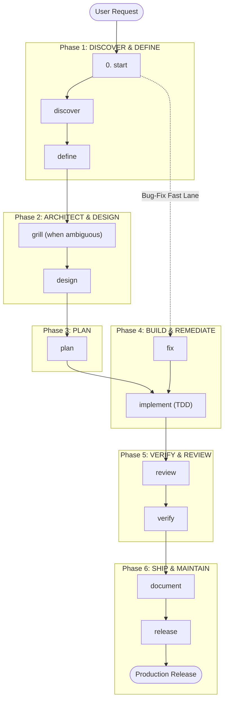

# ⚡ Agent Toolkit

🌐 **Languages**: [English](README.md) | [Bahasa Indonesia](README.id.md)

> **Supercharge your AI coding agents with vendor-neutral SDLC workflows, bounded roles, and reusable skills — installed in seconds with zero dependencies.**

[](LICENSE)
[](#-quick-start)
[](#-supported-platforms--global-paths)

---

## 💡 Why Agentic SDLC Toolkit?

When using AI coding assistants (Claude Code, OpenCode, GitHub Copilot, Codex, Gemini/Antigravity, OMP), unguided agents often jump straight to writing unverified code, hallucinate dependencies, or overwrite critical files.

**Agentic SDLC Toolkit** gives your AI agents a structured, battle-tested software engineering process—from initial discovery and PRDs to specifications, implementation planning, code review, independent verification, and release readiness.

- 🚀 **Zero Dependencies**: Pure Shell & PowerShell installers. No Python or Node runtime needed to install.
- 🎯 **Vendor-Neutral & Portable**: Write your SDLC rules once, deploy seamlessly across any platform.
- 🛡️ **Fail-Closed & Safe**: Preview every install with dry-runs. Never silently overwrites your custom code or config.
- 🤖 **Multi-Platform Native**: Pre-built native packages for Claude Code, OpenCode, Codex, GitHub Copilot, Gemini/Antigravity, and OMP.

---

## 🚀 Quick Start

Run the 1-line installer below to launch an interactive wizard that guides you through platform and scope selection. Installation is **global by default** (skills land in `~/.agents/skills`, shared across platforms) and needs **nothing but a shell** — no Python, no extra tools.

### 🐧 Linux / macOS / WSL
```bash
curl -fsSL https://raw.githubusercontent.com/coderbuzz/agent-toolkit/main/install.sh | bash
```

### 🪟 Windows (PowerShell)
```powershell
irm https://raw.githubusercontent.com/coderbuzz/agent-toolkit/main/install.ps1 | iex
```

> **Pro-Tip (Non-Interactive CI / Automation)**: Pass arguments directly to skip prompts and apply immediately. Global scope is the default:
> ```bash
> # Global install (default): ~/.agents/skills + platform config in ~
> curl -fsSL https://raw.githubusercontent.com/coderbuzz/agent-toolkit/main/install.sh | bash -s -- --platform opencode --apply
>
> # Repository install: commit skills into a project checkout instead
> curl -fsSL https://raw.githubusercontent.com/coderbuzz/agent-toolkit/main/install.sh | bash -s -- --platform opencode --scope repository --target . --apply
> ```

### 🧹 Uninstallation

To safely preview and remove installed toolkit files while preserving user modifications:

```bash
# Interactive uninstaller — remote (Linux / macOS / WSL)
curl -fsSL https://raw.githubusercontent.com/coderbuzz/agent-toolkit/main/uninstall.sh | bash

# Non-interactive / CI mode
curl -fsSL https://raw.githubusercontent.com/coderbuzz/agent-toolkit/main/uninstall.sh | bash -s -- --platform opencode --scope global --apply
```

```powershell
# Interactive uninstaller — remote (Windows PowerShell)
irm https://raw.githubusercontent.com/coderbuzz/agent-toolkit/main/uninstall.ps1 | iex

# Non-interactive mode
irm https://raw.githubusercontent.com/coderbuzz/agent-toolkit/main/uninstall.ps1 | iex -ArgumentList --platform opencode --scope global --apply
```

```bash
# Already cloned? Run locally instead (Linux / macOS / WSL)
./uninstall.sh
./uninstall.sh --scope repository --target . --apply
```

```powershell
# Already cloned? Run locally instead (Windows PowerShell)
.\uninstall.ps1
.\uninstall.ps1 --platform opencode --scope global --apply
```

---

## 🧠 Accessing Skills

The toolkit ships SDLC skills that agents load on demand. How you reach them depends on your platform:

- **`/skills` menu**: Lists every installed skill. OpenCode sorts this list alphabetically by skill name — the order is not the SDLC flow order.
- **Skill tool**: Agents load a skill via the native `skill` tool when it is relevant to the task.
- **OpenCode slash commands**: After a global install, each skill is also available as a `/<name>` command (e.g. `/start`, `/discover`, `/fix`) that loads and runs the matching skill.
- **Naming**: Skill ids use hyphens (`start`), not underscores. Type them exactly.

The natural SDLC flow is: `start → discover → define → design → plan → implement → verify → review → fix → release → document`, with cross-cutting skills (`guardrails`, `memory`, `glossary`, `decide`, `test`, `threat`, `audit-deps`, `orchestrate`) and optional specialists (`design-ui`, `incident`, `observability`, `migrate`).

## 💡 Usage — `/` commands vs `@` mentions

Two entry points in OpenCode trigger different machinery:

| Input | What it does | In this toolkit |
| --- | --- | --- |
| `/<name>` | Runs a **skill** in the current session. | `/start`, `/discover`, `/fix`, ... |
| `@<file>` | Adds a file's content to context. | Not toolkit-specific. |
| `/skills` | Lists all installed skills. | 25 skills (alphabetical). |

In short: a **skill** says *how* to do the work; each skill's frontmatter declares the compact `role` that owns it.

## 🚦 Best practice — starting from zero

1. **Always route first.** Run `/start`. It classifies the task into the smallest safe lane (Full-Feature, Bug-Fix, Small-Change, Docs, Incident) and lists the required artifacts and gates. It never forces the full lifecycle on low-risk work.
2. **Follow the phases by skill.** Each phase is driven by one primary skill:
   - **Discover & Define**: `/discover` → `/define`
   - **Architect & Design**: `/grill` (ambiguity interview) → `/design`
   - **Plan**: `/plan`
   - **Build**: `/implement` (TDD build loop)
   - **Verify & Review**: `/review` → `/verify`
   - **Ship**: `/document` → `/release`
3. **Use the fast lanes.** A bug goes straight to `/fix`. A small reversible change skips the lifecycle entirely. An expensive architecture choice uses `/decide`.
4. **Respect artifact order.** Do not ask for a spec before a PRD, or implementation before an approved plan.
5. **Approve gate actions.** Publishing, deployment, release, destructive changes, and credential changes always require your explicit approval.
6. **Keep the shared language.** Let `context` own CONTEXT.md (glossary, invariants); utility skills (`guardrails`, `memory`, `glossary`) can be invoked anytime.

---

## 🗺️ Workflow & 6-Phase SDLC Lifecycle

Working with AI agents becomes simple and predictable when structured into 6 logical phases + 1 entrypoint navigator:

```
[0. ROUTE / START] ➔ [1. DISCOVER & DEFINE] ➔ [2. ARCHITECT & DESIGN] ➔ [3. PLAN] ➔ [4. BUILD] ➔ [5. VERIFY & REVIEW] ➔ [6. SHIP & OPS]
```

### 📊 End-to-End Workflow Diagram (Mermaid)



---

## 🧰 Skills Reference

### Phase 0: Navigator (Entrypoint)
If you're unsure how to start a task, invoke the navigator skill:
- 🚀 **`start`**: Classifies work into the optimal safety lane (Full-Feature, Bug-Fix, Small-Change, Docs, Incident) and and guides the selected lane step by step.

---

### Phase 1: Discover & Define (Product Scope)
| Primary Skill | Support Skills | Phase Deliverable |
| :--- | :--- | :--- | ---: |
| `discover` | `guardrails` | **Discovery Report** |
| `define` | `glossary` | **Product Requirements Document (PRD)** |

---

### Phase 2: Architect & Design (Technical Design & Security)
| Primary Skill | Support Skills | Phase Deliverable |
| :--- | :--- | :--- | ---: |
| `grill` | `decide` | **Confirmed Understanding / ADR** |
| `design` | `threat`, `design-ui`, `test` | **Technical Specification (Spec)** |

---

### Phase 3: Plan (Execution Planning)
| Primary Skill | Support Skills | Phase Deliverable |
| :--- | :--- | :--- | :--- |
| `plan` | `test` | **Implementation Plan** |

---

### Phase 4: Build & Remediate (Coding & Bug Fixes)
| Primary Skill | Support Skills | Phase Deliverable |
| :--- | :--- | :--- | ---: |
| `implement` | `guardrails`, `migrate`, `audit-deps`, `orchestrate` | **Source Code & Unit Tests** |
| `fix` | `test` | **Root Cause Analysis & Fix Plan** |

---

### Phase 5: Verify & Review (Quality & Security)
| Primary Skill | Support Skills | Phase Deliverable |
| :--- | :--- | :--- | ---: |
| `review` | `audit-deps` | **Code Review Feedback** |
| `verify` | `test` | **Verification Report** |

---

### Phase 6: Ship & Maintain (Release & Operations)
| Primary Skill | Support Skills | Phase Deliverable |
| :--- | :--- | :--- | ---: |
| `document` | `glossary` | **User Guides & Documentation** |
| `release` | `orchestrate` | **Verified Release Candidate** |
| `observability` | `incident`, `memory` | **Logs/Alerts & Incident Post-Mortem** |

---

## 🔄 SDLC Lanes Matrix

The toolkit routes every change into the right lane to prevent unnecessary overhead while maintaining strict guardrails where needed:

| Lane | Trigger & Scope | Required Workflow Sequence |
| :--- | :--- | :--- |
| **Full-Feature** | New capabilities, major architectural changes, public contracts, sensitive data | Discovery → PRD → Spec → Plan → Execution → Review → Verification → Release |
| **Bug-Fix** | Reproducible defects with clear intended behavior | Root Cause Analysis → Minimal Fix Plan → Unit Test & Fix → Verification |
| **Small-Change** | Low-risk, reversible, narrowly scoped changes | Direct Minimal Fix → Focused Test Check → Code Review |
| **Documentation** | Pure documentation, comments, or manual updates | Audit → Draft/Update → Verify Links & Accuracy |
| **Incident** | Active production outage, security breach, or data loss | Severity Assessment → Containment → Root Cause → Post-Mortem |

---

## 💬 Natural Language Prompting Examples

Since skills are installed globally or at the project level, you don't need special UI menus. Simply prompt your AI agent in natural language:

### 1. Starting a New Project / Feature (Getting Started)
```text
"Use start to guide me through building a JWT and OAuth2 authentication system. Create a PRD and technical specification first."
```

### 2. Fixing a Bug (Bug-Fix Lane)
```text
"Users are reporting a 500 server error during checkout when the cart is empty. Use the fix skill to trace the root cause, write a reproduction test, and apply a minimal fix."
```

### 3. Reviewing a Pull Request / Code Changes
```text
"Please perform a code review on the current branch using the review skill. Check for security vulnerabilities, performance bottlenecks, and adherence to our technical spec."
```

### 4. Creating an Architecture Decision Record (ADR)
```text
"We need to evaluate Redis vs PostgreSQL for session caching. Use the decide skill to evaluate trade-offs and draft an ADR."
```

### 5. Running Pre-Release Audit
```text
"Please audit this repository using the release skill before we publish release v1.0.0."
```

---

## 🌐 Supported Platforms & Global Paths

Install once globally into your home directory (`$HOME`) so all your repositories automatically inherit the toolkit's skills:

| Platform | Global Instructions | Global Skills | Slash Commands |
| :--- | :--- | :--- | :--- |
| **Claude Code** | `~/.claude/CLAUDE.md` | `~/.agents/skills/*` | - |
| **OpenCode** | `~/.config/opencode/AGENTS.md` | `~/.agents/skills/*` | `~/.config/opencode/commands/*.md` |
| **Codex** | `~/.codex/AGENTS.md` | `~/.agents/skills/*` | - |
| **GitHub Copilot** | `~/.copilot/copilot-instructions.md` | `~/.agents/skills/*` | - |
| **OMP** | `~/.omp/agent/AGENTS.md` | `~/.agents/skills/*` | - |
| **Gemini / Antigravity** | `~/.gemini/antigravity/AGENTS.md` | `~/.agents/skills/*` | - |

---

## 📦 Skill Bundles

| Bundle | What's Included | Best For |
| :--- | :--- | :--- |
| **`core`** *(default)* | Lifecycle & cross-cutting SDLC skills | Everyday feature development & bug fixes |
| Core + specialist skills (data migration, incident response) | Full product lifecycle & ops |
| Audit, security, threat modeling & verification | Quality overlays for mature repos |

---

## 💻 Contributor & Maintainer Guide

Developing or extending the toolkit itself? Maintainer tools require **Python 3.9+** (Standard Library only — no third-party dependencies required).

### Maintainer Commands

```bash
# Validate canonical skills and manifests
python3 scripts/toolkit.py validate

# Run the complete test suite
python3 -m unittest discover -s tests -v

# Export generated platform packages into dist/
python3 scripts/toolkit.py export --all --bundle core

# Verify no drift between canonical sources and dist/
python3 scripts/toolkit.py check-drift --all --bundle core

# Run full POSIX validation sequence
./scripts/validate-all.sh
```

---

## 🏗️ Repository Architecture

```text
.
├── AGENTS.md                 # Portable core AI guidance (v2 pointer file)
├── manifest.json             # Toolkit manifest & bundle definitions
├── .agents/skills/           # Canonical reusable procedures
├── instructions/             # Shared communication and quality standards
├── standards/                # Architecture & traceability contracts
├── dist/                     # Pre-built packages (per-platform + dist/global)
├── install.sh / install.ps1  # Zero-dependency terminal installer scripts
└── scripts/
    ├── install.sh            # Zero-dependency POSIX installer
    ├── install.ps1           # Zero-dependency PowerShell installer
    ├── uninstall.sh          # Zero-dependency POSIX uninstaller
    ├── uninstall.ps1         # Zero-dependency PowerShell uninstaller
    ├── toolkit-lib.sh        # Shared POSIX helpers (ledgers, managed blocks)
    ├── setup.sh              # Interactive setup helper
    └── toolkit.py            # Maintainer-only build CLI (validate, export, drift-check)
```

---

## 🌟 References & Inspiration

This project draws inspiration and architectural patterns from open-source community standards and official agentic platform specifications:

- **[awesome-copilot-id](https://github.com/GulajavaMinistudio/awesome-copilot-id)** by GulajavaMinistudio – Primary reference for prompt structures, skill format conventions, role definitions, and terminal installation workflows.
- **[OpenCode](https://opencode.ai)** – Agent role definitions and shared skill conventions.
- **[OpenAI Codex & Agent Specifications](https://github.com/openai)** – `AGENTS.md` format and fail-closed permission models.
- **[Anthropic Claude Code](https://docs.anthropic.com)** – `CLAUDE.md` guidelines and subagent patterns.
- **[GitHub Copilot Custom Instructions](https://docs.github.com/en/copilot)** – Custom agent prompt engineering patterns.
- **[Google Antigravity / Gemini CLI](https://cloud.google.com)** – Agentic workflow orchestration standards.

---

## 📄 License

This project is licensed under the [MIT License](LICENSE).
