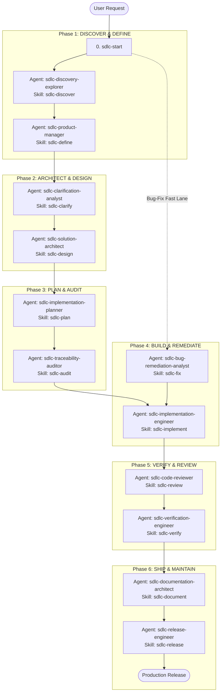

# ⚡ Portable Agentic SDLC Toolkit

🌐 **Languages**: [English](README.md) | [Bahasa Indonesia](README.id.md)

> **Supercharge your AI coding agents with vendor-neutral SDLC workflows, bounded roles, and reusable skills — installed in seconds with zero dependencies.**

[](LICENSE)
[](#-quick-start)
[](#-supported-platforms--global-paths)

---

## 💡 Why Agentic SDLC Toolkit?

When using AI coding assistants (Claude Code, OpenCode, GitHub Copilot, Codex, Gemini/Antigravity, OMP), unguided agents often jump straight to writing unverified code, hallucinate dependencies, or overwrite critical files.

**Agentic SDLC Toolkit** gives your AI agents a structured, battle-tested software engineering process—from initial discovery and PRDs to specifications, implementation planning, code review, independent verification, and release readiness.

- 🚀 **Zero Dependencies**: Pure Shell & PowerShell installers. No Python or Node runtime needed to install.
- 🎯 **Vendor-Neutral & Portable**: Write your SDLC rules once, deploy seamlessly across any platform.
- 🛡️ **Fail-Closed & Safe**: Preview every install with dry-runs. Never silently overwrites your custom code or config.
- 🤖 **Multi-Platform Native**: Pre-built native packages for Claude Code, OpenCode, Codex, GitHub Copilot, Gemini/Antigravity, and OMP.

---

## 🚀 Quick Start

Run the 1-line installer below to launch an interactive wizard that guides you through platform and scope selection:

### 🐧 Linux / macOS / WSL
```bash
curl -fsSL https://raw.githubusercontent.com/coderbuzz/agent-toolkit/main/install.sh | bash
```

### 🪟 Windows (PowerShell)
```powershell
irm https://raw.githubusercontent.com/coderbuzz/agent-toolkit/main/install.ps1 | iex
```

> **Pro-Tip (Non-Interactive CI / Automation)**: Pass arguments directly to skip prompts and apply immediately:
> ```bash
> curl -fsSL https://raw.githubusercontent.com/coderbuzz/agent-toolkit/main/install.sh | bash -s -- --platform opencode --global --apply
> ```

### 🧹 Uninstallation

To safely preview and remove installed toolkit files while preserving user modifications:

```bash
# Interactive uninstaller (Linux / macOS)
./uninstall.sh

# Non-interactive / CI mode
./uninstall.sh --scope repository --target . --apply
```

```powershell
# Interactive uninstaller (Windows PowerShell)
.\uninstall.ps1

# Non-interactive mode
.\uninstall.ps1 --platform opencode --global --apply
```

---


## 🗺️ Workflow & 6-Phase SDLC Lifecycle

Working with AI agents becomes simple and predictable when structured into 6 logical phases + 1 entrypoint navigator:

```
[0. ROUTE / START] ➔ [1. DISCOVER & DEFINE] ➔ [2. ARCHITECT & DESIGN] ➔ [3. PLAN & AUDIT] ➔ [4. BUILD] ➔ [5. VERIFY & REVIEW] ➔ [6. SHIP & OPS]
```

### 📊 End-to-End Workflow Diagram (Mermaid)



---

## 🧰 Comprehensive Agent Roles & Skills Reference

### Phase 0: Navigator (Entrypoint)
If you're unsure how to start a task, invoke the navigator skill:
- 🚀 **`sdlc-start`**: Classifies work into the optimal safety lane (Full-Feature, Bug-Fix, Small-Change, Docs, Incident) and guides step-by-step agent execution.

---

### Phase 1: Discover & Define (Product Scope)
| Agent Role | Primary Skill | Support Skills | Phase Deliverable |
| :--- | :--- | :--- | :--- |
| **`sdlc-discovery-explorer`** | `sdlc-discover` | `sdlc-guardrails` | **Discovery Report** |
| **`sdlc-product-manager`** | `sdlc-define` | `sdlc-glossary` | **Product Requirements Document (PRD)** |

---

### Phase 2: Architect & Design (Technical Design & Security)
| Agent Role | Primary Skill | Support Skills | Phase Deliverable |
| :--- | :--- | :--- | :--- |
| **`sdlc-clarification-analyst`** | `sdlc-clarify` | `sdlc-decide` | **Clarification Q&A / ADR** |
| **`sdlc-solution-architect`** | `sdlc-design` | `sdlc-threat`, `sdlc-design-ui`, `sdlc-test` | **Technical Specification (Spec)** |

---

### Phase 3: Plan & Audit (Execution Planning)
| Agent Role | Primary Skill | Support Skills | Phase Deliverable |
| :--- | :--- | :--- | :--- |
| **`sdlc-implementation-planner`** | `sdlc-plan` | `sdlc-test` | **Implementation Plan** |
| **`sdlc-traceability-auditor`** | `sdlc-audit` | - | **Traceability Audit Report** |

---

### Phase 4: Build & Remediate (Coding & Bug Fixes)
| Agent Role | Primary Skill | Support Skills | Phase Deliverable |
| :--- | :--- | :--- | :--- |
| **`sdlc-implementation-engineer`** | `sdlc-implement` | `sdlc-guardrails`, `sdlc-migrate`, `sdlc-audit-deps`, `sdlc-orchestrate` | **Source Code & Unit Tests** |
| **`sdlc-bug-remediation-analyst`** *(Bug Lane)* | `sdlc-fix` | `sdlc-test` | **Root Cause Analysis & Fix Plan** |

---

### Phase 5: Verify & Review (Quality & Security)
| Agent Role | Primary Skill | Support Skills | Phase Deliverable |
| :--- | :--- | :--- | :--- |
| **`sdlc-code-reviewer`** | `sdlc-review` | `sdlc-audit-deps` | **Code Review Feedback** |
| **`sdlc-verification-engineer`** | `sdlc-verify` | `sdlc-test` | **Verification Report** |

---

### Phase 6: Ship & Maintain (Release & Operations)
| Agent Role | Primary Skill | Support Skills | Phase Deliverable |
| :--- | :--- | :--- | :--- |
| **`sdlc-documentation-architect`** | `sdlc-document` | `sdlc-glossary` | **User Guides & Documentation** |
| **`sdlc-release-engineer`** | `sdlc-release` | `sdlc-orchestrate` | **Verified Release Candidate** |
| *(Operations)* | `sdlc-observability` | `sdlc-incident`, `sdlc-memory` | **Logs/Alerts & Incident Post-Mortem** |

---

## 🔄 SDLC Lanes Matrix

The toolkit routes every change into the right lane to prevent unnecessary overhead while maintaining strict guardrails where needed:

| Lane | Trigger & Scope | Required Workflow Sequence |
| :--- | :--- | :--- |
| **Full-Feature** | New capabilities, major architectural changes, public contracts, sensitive data | Discovery → PRD → Spec → Plan → Execution → Review → Verification → Release |
| **Bug-Fix** | Reproducible defects with clear intended behavior | Root Cause Analysis → Minimal Fix Plan → Unit Test & Fix → Verification |
| **Small-Change** | Low-risk, reversible, narrowly scoped changes | Direct Minimal Fix → Focused Test Check → Code Review |
| **Documentation** | Pure documentation, comments, or manual updates | Audit → Draft/Update → Verify Links & Accuracy |
| **Incident** | Active production outage, security breach, or data loss | Severity Assessment → Containment → Root Cause → Post-Mortem |

---

## 💬 Natural Language Prompting Examples

Since agents and skills are installed globally or at the project level, you don't need special UI menus. Simply prompt your AI agent in natural language:

### 1. Starting a New Project / Feature (Getting Started)
```text
"Use sdlc-start to guide me through building a JWT and OAuth2 authentication system. Create a PRD and technical specification first."
```

### 2. Fixing a Bug (Bug-Fix Lane)
```text
"Users are reporting a 500 server error during checkout when the cart is empty. Use the sdlc-fix skill to trace the root cause, write a reproduction test, and apply a minimal fix."
```

### 3. Reviewing a Pull Request / Code Changes
```text
"Please perform a code review on the current branch using the sdlc-review skill. Check for security vulnerabilities, performance bottlenecks, and adherence to our technical spec."
```

### 4. Creating an Architecture Decision Record (ADR)
```text
"We need to evaluate Redis vs PostgreSQL for session caching. Use the sdlc-decide skill to evaluate trade-offs and draft an ADR."
```

### 5. Running Pre-Release Audit
```text
"Please audit this repository using the sdlc-release skill before we publish release v1.0.0."
```

---

## 🌐 Supported Platforms & Global Paths

Install once globally into your home directory (`$HOME`) so all your repositories automatically inherit your AI agents and skills:

| Platform | Global Instructions | Global Agents | Global Skills |
| :--- | :--- | :--- | :--- |
| **Claude Code** | `~/.claude/CLAUDE.md` | `~/.claude/agents/*.md` | `~/.agents/skills/*` |
| **OpenCode** | `~/.config/opencode/AGENTS.md` | `~/.config/opencode/agents/*.md` | `~/.agents/skills/*` |
| **Codex** | `~/.codex/AGENTS.md` | Managed block in `~/.codex/config.toml` | `~/.agents/skills/*` |
| **GitHub Copilot** | `~/.copilot/copilot-instructions.md` | `~/.copilot/agents/*.agent.md` | `~/.agents/skills/*` |
| **OMP** | `~/.omp/agent/AGENTS.md` | `~/.omp/agent/agents/*.md` | `~/.agents/skills/*` |
| **Gemini / Antigravity** | `~/.gemini/antigravity/AGENTS.md` | `~/.gemini/antigravity/agents/*.md` | `~/.agents/skills/*` |

---

## 📦 Skill Bundles

| Bundle | What's Included | Best For |
| :--- | :--- | :--- |
| **`core`** *(default)* | Lifecycle & cross-cutting SDLC skills | Everyday feature development & bug fixes |
| **`full`** | Core + specialist skills (data migration, incident response) | Full product lifecycle & ops |
| **`quality`** | Audit, security, threat modeling & verification | Quality overlays for mature repos |

---

## 💻 Contributor & Maintainer Guide

Developing or extending the toolkit itself? Maintainer tools require **Python 3.9+** (Standard Library only — no third-party dependencies required).

### Maintainer Commands

```bash
# Validate canonical skills, agent definitions, and manifests
python3 scripts/toolkit.py validate

# Run the complete test suite
python3 -m unittest discover -s tests -v

# Export generated platform packages into dist/
python3 scripts/toolkit.py export --all --bundle core

# Verify no drift between canonical sources and dist/
python3 scripts/toolkit.py check-drift --all --bundle core

# Run full POSIX validation sequence
./scripts/validate-all.sh
```

---

## 🏗️ Repository Architecture

```text
.
├── AGENTS.md                 # Portable core AI guidance
├── manifest.json             # Toolkit manifest & bundle definitions
├── agents/definitions.json   # Neutral agent role definitions
├── .agents/skills/           # Canonical reusable procedures
├── instructions/             # Shared communication and quality standards
├── standards/                # Architecture & traceability contracts
├── dist/                     # Pre-built packages for instant zero-dep installs
├── install.sh / install.ps1  # Zero-dependency terminal installer scripts
└── scripts/
    ├── install.sh            # Zero-dependency POSIX installer
    ├── install.ps1           # Zero-dependency PowerShell installer
    ├── setup.sh              # Interactive setup helper
    └── toolkit.py            # Maintainer CLI (validate, export, drift-check)
```

---

## 🌟 References & Inspiration

This project draws inspiration and architectural patterns from open-source community standards and official agentic platform specifications:

- **[awesome-copilot-id](https://github.com/GulajavaMinistudio/awesome-copilot-id)** by GulajavaMinistudio – Primary reference for prompt structures, skill format conventions, role definitions, and terminal installation workflows.
- **[OpenCode](https://opencode.ai)** – Agent role definitions and shared skill conventions.
- **[OpenAI Codex & Agent Specifications](https://github.com/openai)** – `AGENTS.md` format and fail-closed permission models.
- **[Anthropic Claude Code](https://docs.anthropic.com)** – `CLAUDE.md` guidelines and subagent patterns.
- **[GitHub Copilot Custom Instructions](https://docs.github.com/en/copilot)** – Custom agent prompt engineering patterns.
- **[Google Antigravity / Gemini CLI](https://cloud.google.com)** – Agentic workflow orchestration standards.

---

## 📄 License

This project is licensed under the [MIT License](LICENSE).
