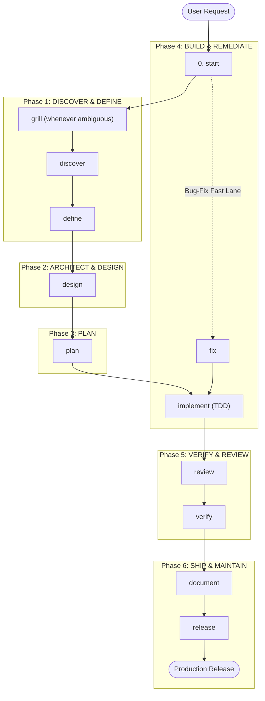

# ⚡ Agent Toolkit

🌐 **Languages**: [English](README.md) | [Bahasa Indonesia](README.id.md)

> **Vendor-neutral work lanes, reusable skills, and approval gates for your AI
> coding agents. You install it by pasting a prompt, not by running an installer.**

[](LICENSE)
[](#-quick-start)
[](#-supported-platforms--global-paths)

---

## 💡 Why Agent Toolkit?

When using AI coding assistants (Claude Code, OpenCode, GitHub Copilot, Codex, Gemini/Antigravity, OMP, ZCode), unguided agents often jump straight to writing unverified code, hallucinate dependencies, or overwrite critical files.

**Agent Toolkit** gives your AI agents an explicit engineering process: discovery and PRDs, then specifications, an implementation plan, code review, independent verification, and release checks. It covers the full SDLC, but applies only the lanes a task actually needs.

- 🚀 **Nothing to install**: You paste a prompt; your agent reads the protocol and does the rest. No script, no runtime, no package manager.
- 🎯 **Vendor-Neutral & Portable**: Write your workflow rules once and install them on any of the seven supported platforms.
- 🛡️ **Fail-Closed & Safe**: Every install is previewed before a byte is written, and a file you edited is never overwritten.
- 🤖 **Multi-Platform Native**: Pre-built native packages for Claude Code, OpenCode, Codex, GitHub Copilot, Gemini/Antigravity, OMP, and ZCode.

---

## 🚀 Quick Start

There is no installer to run. You tell your coding agent to install it, and it
does, by reading [`AGENT-INSTALL.md`](AGENT-INSTALL.md), the install protocol
written for agents rather than for people.

Copy one of these and paste it to your agent.

### Install into this repository (default)

```text
Install agent-toolkit into this repository.

1. Fetch https://github.com/coderbuzz/agent-toolkit (branch: main).
2. Read AGENT-INSTALL.md at the repository root. It is the only instruction
   source for this task. Do not follow README.md and do not improvise.
3. Execute it with: scope=repository, bundle=core.
4. Show me the planned file changes and wait for my confirmation before writing.
5. If AGENT-INSTALL.md is missing, or any step in it fails, stop and tell me.
   Do not install partially.
```

### Install globally, for every project

Same prompt, with step 3 reading:

```text
3. Execute it with: scope=global, bundle=core.
```

### Uninstall

```text
Uninstall agent-toolkit from this repository.

1. Fetch https://github.com/coderbuzz/agent-toolkit (branch: main).
2. Read AGENT-INSTALL.md at the repository root and follow its "Update and
   uninstall" section exactly. It is the only instruction source. Do not
   improvise.
3. Target: scope=repository.
4. Preserve any file I have modified, and show me the plan before deleting
   anything.
```

Works with Claude Code, OpenCode, Codex, GitHub Copilot, Gemini/Antigravity,
OMP, and ZCode. The agent identifies its own platform; if it cannot, it asks.

> **Pin a version** for reproducible setups by replacing `branch: main` with
> `tag: v3.0.0`.
>
> **Bundles:** `core` (27 skills, the default), `full` (31, adds the
> specialists), `quality` (7, review and verification only). Name one in step 3.

> **Coming from 2.0.0?** That version installed with a shell script, and its
> uninstaller is not on `main` any more. It lives on the frozen `release/2.0.0`
> branch. See [Versions](#-versions).

---

## 🧠 How loading works

Installing does not load 31 skills into your agent's context. It writes one
small pointer file (`AGENTS.md`, or `CLAUDE.md` on Claude Code) listing each
skill's name and a one-line trigger. That file is about 1.5 KB, and it is all
your agent reads at the start of a session.

A skill's full text is read only when a task actually calls for it. That is why
adding skills stays cheap: the cost at session start is one line each, not the
188 KB of procedure behind them.

How you reach a skill depends on your platform:

- **`/skills` menu**: Lists every installed skill. OpenCode sorts this list alphabetically by skill name, so the order is not the workflow order.
- **Skill tool**: Agents load a skill via the native `skill` tool when it is relevant to the task.
- **OpenCode slash commands**: After a global install, each skill is also available as a `/<name>` command (e.g. `/start`, `/discover`, `/fix`) that loads and runs the matching skill.
- **Naming**: Skill ids use hyphens (`start`), not underscores. Type them exactly.

The default full-lane flow is: `start → discover → define → design → plan → implement → verify → review → fix → release → document`, with cross-cutting skills (`guardrails`, `memory`, `glossary`, `decide`, `test`, `threat`, `audit-deps`, `orchestrate`), the [antislop family](#-antislop), and optional specialists (`design-ui`, `incident`, `observability`, `migrate`).

## 🧹 antislop

Six of the core skills are the [antislop](https://github.com/miqdadbadjuber/anti-slop)
filter by Miqdad Badjuber, vendored here under MIT. They stop agents producing
generic AI output: blue-purple gradients, invented statistics, copy that reads
like a press release, comments that restate the line below them. It does this
without flattening the result into something sterile.

| Skill | Loads when |
| :--- | :--- |
| `antislop` | The core filter: 38 rules, the liveliness dials, the delivery gate. |
| `antislop-ui` | Building or editing an interface. |
| `antislop-copywriting` | Writing or editing prose. |
| `antislop-code` | Writing or editing code comments. |
| `antislop-human` | Contrast, keyboard, focus, states. Ships a contrast checker. |
| `antislop-layoutmobile` | Layouts that must reflow from phone to desktop. |

The filter removes what should not be there; it does not supply direction. A
`DESIGN.md` of your own is what makes the result yours.

Attribution and the exact adaptations made when vendoring are in
[`NOTICE`](NOTICE) and [`vendor/anti-slop.json`](vendor/anti-slop.json).

---

## 💡 Usage: `/` commands vs `@` mentions

Two entry points in OpenCode trigger different machinery:

| Input | What it does | In this toolkit |
| --- | --- | --- |
| `/<name>` | Runs a **skill** in the current session. | `/start`, `/discover`, `/fix`, ... |
| `@<file>` | Adds a file's content to context. | Not toolkit-specific. |
| `/skills` | Lists all installed skills. | 31 skills (alphabetical). |

In short: a **skill** says *how* to do the work; each skill's frontmatter declares the compact `role` that owns it.

## 🚦 Best practice: starting from zero

1. **Always route first.** Run `/start`. It classifies the task into the smallest safe lane (Full-Feature, Bug-Fix, Small-Change, Docs, Incident) and lists the required artifacts and gates. It never forces the full lifecycle on low-risk work.
2. **Follow the phases by skill.** Each phase is driven by one primary skill:
   - **Discover & Define**: `/discover` → `/define`
   - **Architect & Design**: `/grill` (ambiguity interview) → `/design`
   - **Plan**: `/plan`
   - **Build**: `/implement` (TDD build loop)
   - **Verify & Review**: `/review` → `/verify`
   - **Ship**: `/document` → `/release`
3. **Use the fast lanes.** A bug goes straight to `/fix`. A small reversible change skips the lifecycle entirely. An expensive architecture choice uses `/decide`.
4. **Respect artifact order.** Do not ask for a spec before a PRD, or implementation before an approved plan.
5. **Approve gate actions.** Publishing, deployment, release, destructive changes, and credential changes always require your explicit approval.
6. **Keep the shared language.** Let `context` own CONTEXT.md (glossary, invariants); utility skills (`guardrails`, `memory`, `glossary`) can be invoked anytime.

---

## 🗺️ Workflow & 6-Phase Lifecycle

Working with AI agents becomes simple and predictable when structured into 6 logical phases + 1 entrypoint navigator:

```
[0. ROUTE / START] ➔ [1. DISCOVER & DEFINE] ➔ [2. ARCHITECT & DESIGN] ➔ [3. PLAN] ➔ [4. BUILD] ➔ [5. VERIFY & REVIEW] ➔ [6. SHIP & OPS]
```

### 📊 End-to-End Workflow Diagram (Mermaid)



---

## 🧰 Skills Reference

The [antislop](#-antislop) skills are not listed per phase: they apply wherever
a task produces an interface, prose, or code comments.

### Phase 0: Navigator (Entrypoint)
If you're unsure how to start a task, invoke the navigator skill:
- 🚀 **`start`**: Classifies work into the optimal safety lane (Full-Feature, Bug-Fix, Small-Change, Docs, Incident) and guides the selected lane step by step.

---

### Phase 1: Discover & Define (Product Scope)
| Primary Skill | Support Skills | Phase Deliverable |
| :--- | :--- | :--- |
| `discover` | `guardrails` | **Discovery Report** |
| `define` | `glossary` | **Product Requirements Document (PRD)** |

---

### Phase 2: Architect & Design (Technical Design & Security)
| Primary Skill | Support Skills | Phase Deliverable |
| :--- | :--- | :--- |
| `grill` | `decide` | **Confirmed Understanding / ADR** |
| `design` | `threat`, `design-ui`, `test` | **Technical Specification (Spec)** |

---

### Phase 3: Plan (Execution Planning)
| Primary Skill | Support Skills | Phase Deliverable |
| :--- | :--- | :--- |
| `plan` | `test` | **Implementation Plan** |

---

### Phase 4: Build & Remediate (Coding & Bug Fixes)
| Primary Skill | Support Skills | Phase Deliverable |
| :--- | :--- | :--- |
| `implement` | `guardrails`, `migrate`, `audit-deps`, `orchestrate` | **Source Code & Unit Tests** |
| `fix` | `test` | **Root Cause Analysis & Fix Plan** |

---

### Phase 5: Verify & Review (Quality & Security)
| Primary Skill | Support Skills | Phase Deliverable |
| :--- | :--- | :--- |
| `review` | `audit-deps` | **Code Review Feedback** |
| `verify` | `test` | **Verification Report** |

---

### Phase 6: Ship & Maintain (Release & Operations)
| Primary Skill | Support Skills | Phase Deliverable |
| :--- | :--- | :--- |
| `document` | `glossary` | **User Guides & Documentation** |
| `release` | `orchestrate` | **Verified Release Candidate** |
| `observability` | `incident`, `memory` | **Logs/Alerts & Incident Post-Mortem** |

---

## 🔄 Work Lanes Matrix

The toolkit routes every change into the right lane to prevent unnecessary overhead while maintaining strict guardrails where needed:

| Lane | Trigger & Scope | Required Workflow Sequence |
| :--- | :--- | :--- |
| **Full-Feature** | New capabilities, major architectural changes, public contracts, sensitive data | Discovery → PRD → Spec → Plan → Execution → Review → Verification → Release |
| **Bug-Fix** | Reproducible defects with clear intended behavior | Root Cause Analysis → Minimal Fix Plan → Unit Test & Fix → Verification |
| **Small-Change** | Low-risk, reversible, narrowly scoped changes | Direct Minimal Fix → Focused Test Check → Code Review |
| **Documentation** | Pure documentation, comments, or manual updates | Audit → Draft/Update → Verify Links & Accuracy |
| **Incident** | Active production outage, security breach, or data loss | Severity Assessment → Containment → Root Cause → Post-Mortem |

---

## 💬 Natural Language Prompting Examples

Since skills are installed globally or at the project level, you don't need special UI menus. Simply prompt your AI agent in natural language:

### 1. Starting a New Project / Feature (Getting Started)
```text
"Use start to guide me through building a JWT and OAuth2 authentication system. Create a PRD and technical specification first."
```

### 2. Fixing a Bug (Bug-Fix Lane)
```text
"Users are reporting a 500 server error during checkout when the cart is empty. Use the fix skill to trace the root cause, write a reproduction test, and apply a minimal fix."
```

### 3. Reviewing a Pull Request / Code Changes
```text
"Please perform a code review on the current branch using the review skill. Check for security vulnerabilities, performance bottlenecks, and adherence to our technical spec."
```

### 4. Creating an Architecture Decision Record (ADR)
```text
"We need to evaluate Redis vs PostgreSQL for session caching. Use the decide skill to evaluate trade-offs and draft an ADR."
```

### 5. Running Pre-Release Audit
```text
"Please audit this repository using the release skill before we publish release v1.0.0."
```

---

## 🌐 Supported Platforms & Global Paths

A repository install is the default. Ask for a **global** install instead and the toolkit lands in your home directory, so every repository inherits it:

| Platform | Global Instructions | Global Skills | Slash Commands |
| :--- | :--- | :--- | :--- |
| **Claude Code** | `~/.claude/CLAUDE.md` | `~/.agents/skills/*` | - |
| **OpenCode** | `~/.config/opencode/AGENTS.md` | `~/.agents/skills/*` | `~/.config/opencode/commands/*.md` |
| **Codex** | `~/.codex/AGENTS.md` | `~/.agents/skills/*` | - |
| **GitHub Copilot** | `~/.copilot/copilot-instructions.md` | `~/.agents/skills/*` | - |
| **OMP** | `~/.omp/agent/AGENTS.md` | `~/.agents/skills/*` | - |
| **Gemini / Antigravity** | `~/.gemini/antigravity/AGENTS.md` | `~/.agents/skills/*` | - |
| **ZCode** | `~/.zcode/AGENTS.md` | `~/.agents/skills/*` | - (native `/<name>`) |

---

## 📦 Skill Bundles

| Bundle | Skills | What's Included | Best For |
| :--- | ---: | :--- | :--- |
| **`core`** *(default)* | 27 | Lifecycle, cross-cutting, and antislop skills | Everyday feature development & bug fixes |
| **`full`** | 31 | Core plus the specialists (`design-ui`, `incident`, `observability`, `migrate`) | Full product lifecycle & ops |
| **`quality`** | 7 | Grilling, guardrails, tests, threat modelling, dependency audit, review, verification | Quality overlays for mature repos |

Name a bundle in step 3 of the install prompt. Omit it and you get `core`.

---

## 🏷️ Versions

| Version | Branch | Tag | Install method |
| :--- | :--- | :--- | :--- |
| **3.0.0** *(current)* | `main` | `v3.0.0` | Agent prompt → [`AGENT-INSTALL.md`](AGENT-INSTALL.md) |
| 2.0.0 | `release/2.0.0` | `v2.0.0` | Shell / PowerShell script |
| 1.0.0 | `release/1.0.0` | `v1.0.0` | Shell / PowerShell script |

The older branches are frozen, and every command in their READMEs points at
themselves, so their installers and uninstallers keep working.

**Migrating from 2.0.0.** The ledger format did not change, so a 2.0.0 install
can be removed by either route. But if you saved a 2.0.0 command, its URL points
at `main`, which no longer ships those scripts. Use this instead:

```bash
curl -fsSL https://raw.githubusercontent.com/coderbuzz/agent-toolkit/release/2.0.0/uninstall.sh | bash
```

```powershell
irm https://raw.githubusercontent.com/coderbuzz/agent-toolkit/release/2.0.0/uninstall.ps1 | iex
```

Then install 3.0.0 with the prompt above. Full notes in
[`CHANGELOG.md`](CHANGELOG.md).

---

## 💻 Contributor & Maintainer Guide

Developing or extending the toolkit itself? Maintainer tools require **Python 3.9+**, Standard Library only. No third-party dependencies.

### Maintainer Commands

```bash
# Validate canonical skills and manifests
python3 scripts/toolkit.py validate

# Run the complete test suite
python3 -m unittest discover -s tests -v

# Export generated platform packages into dist/
python3 scripts/toolkit.py export --all --bundle core

# Verify no drift between canonical sources and dist/
python3 scripts/toolkit.py check-drift --all --bundle core

# Re-sync the vendored antislop skills from an upstream checkout
python3 scripts/vendor-anti-slop.py ../anti-slop

# Run the full validation sequence
./scripts/validate-all.sh
```

`scripts/toolkit.py` keeps `install` and `uninstall` subcommands. They are the
executable reference that [`AGENT-INSTALL.md`](AGENT-INSTALL.md) describes and
that `tests/test_agent_protocol.py` checks the protocol against. It is not the
supported way for you to install the toolkit.

---

## 🏗️ Repository Architecture

```text
.
├── AGENT-INSTALL.md          # The install protocol agents read and execute
├── AGENTS.md                 # The pointer file installed into a project or $HOME
├── manifest.json             # Toolkit manifest & bundle definitions
├── CHANGELOG.md              # Releases, and how to move between them
├── NOTICE                    # Third-party attribution (antislop, MIT)
├── .agents/skills/           # Canonical reusable procedures
├── instructions/             # Shared communication and quality standards
├── standards/                # Architecture & traceability contracts
├── templates/                # Artifact templates
├── platforms/                # Per-platform path adapters
├── vendor/                   # Vendoring records for third-party skills
├── dist/                     # Pre-built packages (per-platform + dist/global)
└── scripts/
    ├── toolkit.py            # Maintainer build CLI (validate, export, drift-check)
    ├── vendor-anti-slop.py   # Re-syncs the vendored antislop skills
    └── validate-all.sh/.ps1  # The full maintainer validation sequence
```

---

## 🌟 References & Inspiration

This project draws inspiration and architectural patterns from open-source community standards and official agentic platform specifications:

- **[mattpocock/skills](https://github.com/mattpocock/skills)** by Matt Pocock – Principles-first skill design and the direct inspiration for v2: the user-invoked vs model-invoked taxonomy, grilling before ambiguous or irreversible work (`grill`), shared language via CONTEXT.md (`context`), and TDD as a build discipline folded into `implement`.
- **[awesome-copilot-id](https://github.com/GulajavaMinistudio/awesome-copilot-id)** by GulajavaMinistudio – Primary reference for prompt structures, skill format conventions, role definitions, and terminal installation workflows.
- **[OpenCode](https://opencode.ai)** – Agent role definitions and shared skill conventions.
- **[OpenAI Codex & Agent Specifications](https://github.com/openai)** – `AGENTS.md` format and fail-closed permission models.
- **[Anthropic Claude Code](https://docs.anthropic.com)** – `CLAUDE.md` guidelines and subagent patterns.
- **[GitHub Copilot Custom Instructions](https://docs.github.com/en/copilot)** – Custom agent prompt engineering patterns.
- **[Google Antigravity / Gemini CLI](https://cloud.google.com)** – Agentic workflow orchestration standards.

---

## 📄 License

This project is licensed under the [MIT License](LICENSE).
